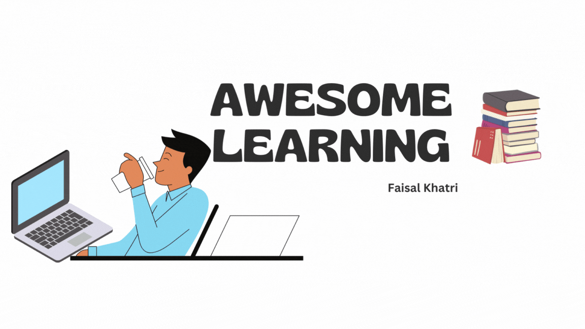

# Awesome Learning

I have been into Software Testing role since last 14+ years, however I must tell you that my most of the time was spent in manual testing the applications. When I got into this role, specifically it was the time when there used to be a lot of desktop applications. I started my career in 2008, being a Commerce graduate and not knowing the basic alphabets of engineering, initially it was very difficult to understand what programming, testing, releases was all about! Thanks to all my mentors and guides, they helped me a lot to understand those basic concepts about testing and how the actual process works.

I have been asked by many about my career transformation journey from Manual Testing to a Test Automation Engineer, hence I thought of creating this repository which has the learning path I followed to become a Test Automation Engineer.

## Don't forget to give a :star: to make the project popular
- Check out links to my LinkedIn Profile, Medium blogs and other social media sites on [LinkTree](https://linktr.ee/faisalkhatri)

# RoadMaps
- [QA Roadmap by Anas Fitiani](https://github.com/fityanos/awesome-quality-assurance-roadmap)
- [DevOps Roadmap by Milan Milanovic](https://github.com/milanm/DevOps-Roadmap)
- [Threat Modelling Roadmap by Hysn Technologies Inc](https://github.com/hysnsec/awesome-threat-modelling)
- [Developer Roadmaps](https://roadmap.sh/)

# Awesome Open Source

- [Goldmine of all Open Source softwares](https://awesomeopensource.com)

# Programming languages 

Java

- [Java Roadmap](https://roadmap.sh/java)
- [Java Programming Course by Angie Jones](https://testautomationu.applitools.com/java-programming-course/)
- [Beginners Book - Java Tutorials](https://beginnersbook.com/java-tutorial-for-beginners-with-examples/)
- [Learn Java Online](https://www.learnjavaonline.org/)
- [Learn Java - Codecademy](https://www.codecademy.com/learn/learn-java)
- [Java Best Practices](https://github.com/in28minutes/java-best-practices)
- [Java problems for practice - w3resources](https://www.w3resource.com/java-exercises/)
- [Java Problems for practice - Codingbat](https://codingbat.com/java)
- [Java Programming examples - Geeks for Geeks](https://www.geeksforgeeks.org/java-programming-examples/)
- [Java Programming examples - Programiz](https://www.programiz.com/java-programming/examples)
- [Java Programming examples - CodeAbbey](https://www.codeabbey.com/)
- [Java 67](https://www.java67.com/)
- [Mkyong](https://mkyong.com/)
- [Vogella - Java Tutorials](https://www.vogella.com/tutorials/java.html)
- [CodeGym](https://codegym.cc/)
- [SoloLearn](https://www.sololearn.com/learn/courses/java-introduction)
- [Java Design Patterns - Refactoring Guru](https://refactoring.guru/design-patterns)
- [Java Design Patterns - Github](https://github.com/iluwatar/java-design-patterns)
- [Introduction to Computer Science using Java](https://chortle.ccsu.edu/Java5/index.html#10)
- [W3Schools](https://www.w3schools.com/java/)
- [Head First Design Patterns](https://www.oreilly.com/library/view/head-first-design/0596007124/)
- [Clean Code](https://www.oreilly.com/library/view/clean-code-a/9780136083238/)
- [Refactoring](https://refactoring.guru/refactoring)
- [Awesome-Java](https://github.com/akullpp/awesome-java)
- [Top 10 GitHub Repositories to Master Java: From Basics to Advanced Concepts!](https://medium.com/@iamfaisalkhatri/top-10-github-repositories-to-master-java-from-basics-to-advanced-concepts-80411bc6a2a7)
- [How to Read JSON Files in Java Using the Google Gson Library](https://dzone.com/articles/how-to-read-json-files-in-java-using-google-gson-l)
- [How to serialize JSON API requests using Java Records?](https://coderlegion.com/477/how-to-serialize-json-api-requests-using-java-records)
- [Getting Started with Java for Data](https://www.datacamp.com/code-along/getting-started-with-java-for-data)

JavaScript

- [JavaScript Roadmap](https://roadmap.sh/javascript)
- [Beginners Series to JavaScript](https://learn.microsoft.com/en-us/shows/beginners-series-to-javascript/)
- [Learn JavaScript for Beginners – JS Basics Handbook](https://www.freecodecamp.org/news/learn-javascript-for-beginners/)
- [Learn JavaScript – Free JS Courses for Beginners](https://www.freecodecamp.org/news/learn-javascript-free-js-courses-for-beginners/)
- [learn-js](https://www.learn-js.org/)
- [Javascript.info](https://javascript.info/)
- [JavaScript Tutorial on Test Automation University](https://testautomationu.applitools.com/javascript-tutorial/)
- [Javascript.com](https://www.javascript.com/try)
- [W3Schools](https://www.w3schools.com/js/)
- [Eloquent JavaScript](https://eloquentjavascript.net/)
- [Full Stack Academy](https://www.fullstackacademy.com/blog/learn-javascript-for-free-13-online-tutorials-resources)
- [Awesome-JavaScript](https://github.com/sorrycc/awesome-javascript)
- [Learn JavaScript - Codecademy](https://www.codecademy.com/learn/introduction-to-javascript)
- [JavaScript Design Patterns](https://www.patterns.dev/)
- [JavaScript Design Patterns – Explained with Examples](https://www.freecodecamp.org/news/javascript-design-patterns-explained/)

TypeScript

- [TypeScript Roadmap](https://roadmap.sh/typescript)
- [Learn TypeScript from Scratch](https://www.typescriptlang.org/docs/handbook/typescript-from-scratch.html)
- [TypeScript Course for Beginners](https://www.youtube.com/watch?v=BwuLxPH8IDs)
- [Learn TypeScript - The Ultimate Beginners Guide](https://www.freecodecamp.org/news/learn-typescript-beginners-guide/)
- [Learn TypeScript – A Comprehensive Guide for Beginners](https://www.freecodecamp.org/news/typescript-for-beginners-guide/)
- [TypeScript Cash Course with Matt Pocock](https://learn.microsoft.com/en-us/shows/vs-code-livestreams/typescript-crash-course-with-matt-pocock)
- [TypeScript Tutorial](https://www.typescripttutorial.net/)
- [LearnTypeScript.dev](https://learntypescript.dev/)
- [TypeScriptLang.org](https://www.typescriptlang.org/)
- [TotalTypeScript](https://www.totaltypescript.com/tutorials)
- [TypeScript Full Tutorial by The Net Ninja](https://www.youtube.com/playlist?list=PL4cUxeGkcC9gUgr39Q_yD6v-bSyMwKPUI)
- [TypeScript Beginner's Course by Sam Pigott](https://dev.to/sam_piggott/full-typescript-beginner-s-course-free-22mg)
- [TypeScript Online Tests - Tutorials Teacher](https://www.tutorialsteacher.com/online-test/typescript-test)
- [TypeScript Tutorial in VSCode](https://code.visualstudio.com/docs/typescript/typescript-tutorial)
- [TypeScript](https://github.com/Microsoft/TypeScript)
- [Awesome TypeScript](https://github.com/semlinker/awesome-typescript)
- [Awesome TypeScript projects](https://github.com/brookshi/awesome-typescript-projects)
- [TypeScript Tips](https://github.com/jellydn/typescript-tips)
- [Awesome-TypeScript](https://github.com/ellerbrock/awesome-typescript)

Python

- [Python Roadmap](https://roadmap.sh/python)
- [Real Python Tutorials](https://realpython.com/)
- [Learn Python](https://www.learnpython.org/)
- [Automate the Boring Stuff with Python](https://automatetheboringstuff.com/)
- [Kaggle: Your Machine Learning and Data Science Community](https://www.kaggle.com/)
- [Python Programming course on FreeCodeCamp](https://www.freecodecamp.org/news/python-programming-course/)
- [Getting Started with Python - Python.org](https://www.python.org/about/gettingstarted/)
- [Python for Beginners](https://learn.microsoft.com/en-us/windows/python/beginners)
- [Introduction to Python](https://learn.microsoft.com/en-us/training/modules/intro-to-python/)
- [Python Tutorial - Test Automation University ](https://testautomationu.applitools.com/python-tutorial/)
- [Awesome Python](https://github.com/vinta/awesome-python)
- [Awesome Python Books](https://github.com/junnplus/awesome-python-books)
- [Python Tutorial - W3Schools](https://www.w3schools.com/python/)
- [Python Programming - Programiz](https://www.programiz.com/python-programming)
- [Learn Python - Kaggle.com](https://www.kaggle.com/learn/python)
- [Python Full Course - Bro Code](https://www.youtube.com/watch?v=XKHEtdqhLK8)
- [Learn Python – Free Python Courses for Beginners](https://www.freecodecamp.org/news/learn-python-free-python-courses-for-beginners/)
- [Python Cheat Sheet for Beginners](https://www.datacamp.com/cheat-sheet/getting-started-with-python-cheat-sheet)
- [How to Learn Python From Scratch in 2025: An Expert Guide](https://www.datacamp.com/blog/how-to-learn-python-expert-guide)
- [21 Essential Python Tools](https://www.datacamp.com/tutorial/21-essential-python-tools)
- [Importing Data in Python Cheat Sheet](https://www.datacamp.com/cheat-sheet/importing-data-in-python-cheat-sheet)
- [Python Data Visualization: Bokeh Cheat Sheet](https://www.datacamp.com/cheat-sheet/python-data-visualization-bokeh-cheat-sheet)
- [Working with Dates and Times in Python Cheat Sheet](https://www.datacamp.com/cheat-sheet/working-with-dates-and-times-in-python-cheat-sheet)
- [30 Cool Python Tricks For Better Code With Examples](https://www.datacamp.com/tutorial/python-tips-examples)

Data Structures & Algorithms

- [DS & A Roadmap](https://roadmap.sh/datastructures-and-algorithms)
- [Awesome Algorithms](https://github.com/tayllan/awesome-algorithms) 
- [DS & A - Programiz](https://www.programiz.com/dsa)
- [DS & A in JavaScript](https://github.com/amejiarosario/dsa.js-data-structures-algorithms-javascript)
- [DS & A Problems](https://github.com/mandliya/algorithms_and_data_structures)
- [Algo Deck](https://github.com/teivah/algodeck)
- [Roadmap for DSA](https://www.codechef.com/roadmap/data-structures-and-algorithms)

Other Learning Materials 

- [Project based learning](https://github.com/practical-tutorials/project-based-learning)
- [Learn Regex step by step, from zero to advanced.](https://regexlearn.com/)

Free Programming Books 

- [Programming in Java - An Interdisciplinary approach](https://introcs.cs.princeton.edu/java/home/)
- [Python Cheat Sheet](https://www.pythoncheatsheet.org/)
- [Free Computer Programming Books](https://freecomputerbooks.com/)
- [300+ Best Free Programming Books](https://www.theinsaneapp.com/2021/01/free-programming-books.html)
- [14 Excellent free books to learn Java](https://www.linuxlinks.com/excellent-free-books-learn-java/)
- [Free JavaScript Books](https://gist.github.com/WebRTCGame/9fa80ed32a7413bd0f8d71304d6335eb)

# Coding Principles 

SOLID

- [Solid Principles - Baeldung](https://www.baeldung.com/solid-principles)
- [Solid Principles - Howtodoinjava](https://howtodoinjava.com/best-practices/solid-principles/)
- [Design Principles in Java](https://www.tpointtech.com/design-principles-in-java)

KISS

- [Kiss software design principle - Baeldung](https://www.baeldung.com/cs/kiss-software-design-principle)
- [How to use KISS Principle in design - FreeCodeCamp](https://www.freecodecamp.org/news/keep-it-simple-stupid-how-to-use-the-kiss-principle-in-design/)
- [Programming - Rules of Thumb](https://wou.edu/las/cs/csclasses/cs161/Lectures/rulesofthumb.html)

YAGNI

- [YAGNI - Martin Fowler](https://martinfowler.com/bliki/Yagni.html)
- [Deep Dive in KISS and YAGNI](https://solidstudio.io/blog/deep-dive-into-kiss-and-yagni)

DRY

- [DRY, KISS & YAGNI Principles](https://henriquesd.medium.com/dry-kiss-yagni-principles-1ce09d9c601f)
- [DRY Software Design Principle](https://www.baeldung.com/cs/dry-software-design-principle)
- [DRY (Don’t Repeat Yourself) In Java](https://www.w3schools.blog/dry-dont-repeat-yourself-in-java)

OOPS

- [Object-Oriented Programming Principles  in Java:  OOP Concepts for Beginners](https://www.freecodecamp.org/news/java-object-oriented-programming-system-principles-oops-concepts-for-beginners/)
- [How to explain object-oriented programming concepts to a 6-year-old](https://www.freecodecamp.org/news/object-oriented-programming-concepts-21bb035f7260/)
- [What are four basic principles of Object Oriented Programming?](https://medium.com/@cancerian0684/what-are-four-basic-principles-of-object-oriented-programming-645af8b43727)

# Software Design and Architecture

Free tutorials

- [System Design Roadmap](https://roadmap.sh/system-design)
- [Top 10 Free System Design Courses and Tutorials in 2024](https://medium.com/javarevisited/hello-guys-if-you-are-preparing-for-system-design-interview-or-just-want-to-improve-your-software-7bc0034ac015)
- [How to Learn Software Design and Architecture - a Roadmap](https://www.freecodecamp.org/news/software-design/)
- [Software Design Basics - Tutorialspoint](https://www.tutorialspoint.com/software_engineering/software_design_basics.htm)
- [Software Design Introduction](https://jenkov.com/tutorials/software-design/index.html)
- [Software Design Tutorial](https://www.geeksforgeeks.org/system-design-tutorial/)
- [Different Types of Software Design Principles](https://www.scholarhat.com/tutorial/designpatterns/different-types-of-software-design-principles)
- [system-design-101](https://github.com/ByteByteGoHq/system-design-101)
- [system-design-primer](https://github.com/donnemartin/system-design-primer)
- [system-design](https://github.com/karanpratapsingh/system-design)
- [system-design-interview](https://github.com/checkcheckzz/system-design-interview)
- [System Design Preparation](https://github.com/shashank88/system_design)
- [System Design Resources](https://github.com/InterviewReady/system-design-resources)
- [System Design Learning Resources](https://github.com/systemdesign42/system-design)
- [Awesome System Design](https://github.com/alexpate/awesome-design-systems)
- [ByteByteGo - YouTube](https://www.youtube.com/channel/UCZgt6AzoyjslHTC9dz0UoTw)
- [System Design for Beginners Course](https://youtu.be/m8Icp_Cid5o?si=4gXNn79VpQLQDBoE)
 

# Software Testing

Free Tutorials and Courses

- [QA Roadmap](https://roadmap.sh/qa)
- [Test Automation University](https://testautomationu.applitools.com/)
- [Free Code Camp](https://www.freecodecamp.org/news/tag/software-testing/) 
- [DZone - Testing, Tools and Frameworks](https://dzone.com/testing-tools-and-frameworks)
- [LambdaTest Learning Hub](https://www.lambdatest.com/learning-hub/)
- [Guru99.com](https://www.guru99.com/software-testing.html)
- [Software Testing Material](https://www.softwaretestingmaterial.com/)
- [Software Testing Help](https://www.softwaretestinghelp.com/)
- [Postman Learning Centre](https://learning.postman.com/docs/getting-started/introduction/)
- [BlazeMeter University](https://www.blazemeter.com/university)
- [Guru99.com - Software Testing](https://www.guru99.com/software-testing.html)
- [Setting a Foundation for Successful Test Automation](https://testautomationu.applitools.com/setting-a-foundation-for-successful-test-automation/)
- [Beyond Bugs: Exploring the Depths of Software Testing](https://medium.com/@iamfaisalkhatri/beyond-bugs-exploring-the-depths-of-software-testing-6a3b7057060e)
- [Practical Guide on Continuous Integration for automation tests](https://medium.com/@iamfaisalkhatri/practical-guide-on-continuous-integration-for-automation-tests-vtest-blog-23e6d37f523f)
- [Best Examples of Functional Test Cases](https://medium.com/@iamfaisalkhatri/best-examples-of-functional-test-cases-agilitest-blog-424260298b5)
- [Best Practices for Test Automation Framework](https://medium.com/@iamfaisalkhatri/best-practices-for-test-automation-framework-vtest-blog-277ee1682e24)
- [Parallel Execution of Tests using Selenium Grid 4 with Docker Compose](https://medium.com/@iamfaisalkhatri/parallel-execution-of-tests-using-selenium-grid-4-with-docker-compose-2dc243f4fe8b)
- [What questions should I ask as a new QA in the Team/Organization?](https://medium.com/@iamfaisalkhatri/what-questions-should-i-ask-as-a-new-qa-in-the-team-organization-459cc2f69017)
- [The Art of Defect Reporting](https://medium.com/@iamfaisalkhatri/the-art-of-defect-reporting-b076310580df)
- [Exploratory Testing](https://medium.com/@iamfaisalkhatri/exploratory-testing-9a17653739d)
- [Different Types of Software Testing](https://www.atlassian.com/continuous-delivery/software-testing/types-of-software-testing)
- [Beyond Bugs: Exploring the Depths of Software Testing](https://medium.com/@iamfaisalkhatri/beyond-bugs-exploring-the-depths-of-software-testing-6a3b7057060e)
- [Free LIVE Manual Testing Demo Project for Training](https://www.guru99.com/live-testing-project.html)
- [Manual Testing - Test cases and Templates](https://github.com/mfaisalkhatri/Manual_Testing)
- [TestDrive by Scandium (Webinar) - Balancing Tradition and Innovation in QA: A career path to success](https://www.youtube.com/watch?v=N9W1BIcQYgQ)
- [Practical Guide to Mobile Testing | Mobile Testing Tutorial | Software Testing | Podcast](https://www.youtube.com/live/U3_abrmhCok?si=QQ5kmtH_KGFKmL-N)
- [Types of Software Testing](https://www.geeksforgeeks.org/types-software-testing/)
- [How To Use Builder Design Pattern and DataFaker Library for Test Data Generation in Automation Testing](https://dzone.com/articles/automation-testing-how-to-use-builder-design-patte)
- [A Complete Guide to Web Testing[With Best Practices]](https://medium.com/@iamfaisalkhatri/a-complete-guide-web-testing-748b34a91e6e)
- [16 Software Testing Challenges: How to Handle Them](https://www.testingmind.com/16-software-testing-challenges-how-to-handle-them/)
- [Challenges to Software Testing](https://www.softwaretestinggenius.com/challenges-to-software-testing/)
- [A Complete Guide to Codeless Testing](https://medium.com/@iamfaisalkhatri/a-complete-guide-to-codeless-testing-2d43c8ba205c)
- [Five Point Plan To Start Automation Testing](https://medium.com/gitconnected/five-point-plan-to-start-automation-testing-ea009ecca604)
- [Software Testing Interview Preparation](https://youtube.com/playlist?list=PLMer2TvhZIw9WWVaZM80epFfZ9aErSGHZ&si=9JmnPTQbUKpcpkRU)
- [Software Testing Tutorials](https://youtube.com/playlist?list=PLMer2TvhZIw-Qhz82h0BvWWemgO-PQQaN&si=3F97zJxGhOyqJhUx)
- [Selenium Webdriver Data Driven Testing | Reading test data from Excel Sheet](https://youtu.be/KtsnA-F-nRs?si=Lj4kdV-anyMQBbr1)
- [Selenium WebDriver Data Driven Testing| Reading data from JSON file](https://youtu.be/9a7WOl_VUog?si=ew1OOd1S1mQ3fRjS)

Software Testing/Test Automation/Blogs and Guides

- [Top 10 GitHub Repositories for Software Testers!!](https://medium.com/@iamfaisalkhatri/top-10-github-repositories-for-software-testers-4db66106ed18)
- [Awesome-Testing](https://github.com/TheJambo/awesome-testing)
- [Awesome-test-automation](https://github.com/atinfo/awesome-test-automation)
- [Marting Fowler's Blog](https://martinfowler.com/tags/testing.html)
- [Angie Jone's Blog](https://angiejones.tech/)
- [Corina Pip's Blog](https://imalittletester.com/)
- [Filip hrics's Blog](https://filiphric.com/)
- [Alan Richardson's Blog](https://www.eviltester.com/blog/)
- [Mohammad Faisal Khatri's Blog](https://medium.com/@iamfaisalkhatri)
- [Jason Swett's Blog(Has a good collection of blogs related to ruby rails testing, docker and other testing stuff)](https://www.codewithjason.com/articles/)
- [Test Guild by Joe Colantonio](https://testguild.com/blog/)
- [Dan Ashby's Blog](https://danashby.co.uk/)
- [Google Testing Blog](https://testing.googleblog.com/)
- [LambdaTest Blog](https://www.lambdatest.com/blog/)
- [LambdaTest Learning Hub](https://www.lambdatest.com/learning-hub/)
- [pCloudy Blog ](https://www.pcloudy.com/blog/)
- [VTest Software Corp Blog](https://www.vtestcorp.com/blog/)
- [BrowserStack Blog](https://www.browserstack.com/blog/)
- [Software Testing News](https://www.softwaretestingnews.co.uk/)
- [OnTestAutomation](https://www.ontestautomation.com/blog/)
- [Articles by Lisa Crispin](https://lisacrispin.com/articles/) 
- [Wasiq Bhamla's Blog](https://medium.com/@WasiqB)
- [How they test?](https://github.com/abhivaikar/howtheytest)
- [Actions to be taken by a QA on finding a Critical Issue in Production](https://medium.com/@iamfaisalkhatri/actions-to-be-taken-by-a-qa-on-finding-a-critical-issue-in-production-b58acf716bed)
- [What questions should I ask as a new QA in the Team/Organization?](https://medium.com/@iamfaisalkhatri/what-questions-should-i-ask-as-a-new-qa-in-the-team-organization-459cc2f69017)
- [What Is a Bug Bash?](https://dzone.com/articles/bug-bash-guide)
- [Top Ways to Boost Team Morale and Increase Productivity](https://medium.com/@iamfaisalkhatri/top-ways-to-boost-team-morale-and-increase-productivity-626219502e75)

YouTube Channels

- [Selenium Conference](https://www.youtube.com/@seleniumconf)
- [Appium Conference](https://www.youtube.com/playlist?list=PL9Z-JgiTsOYRCcJhDfmKAah9XmAp2b903)
- [Conf Engine](https://www.youtube.com/@ConfEngine)
- [GOTO Conferences](https://www.youtube.com/@GOTO-)
- [O'Reilly](https://www.youtube.com/@oreilly)
- [Continuous Delivery](https://www.youtube.com/@ContinuousDelivery)
- [ByteByteGo](https://www.youtube.com/@ByteByteGo)
- [Programming with Mosh](https://www.youtube.com/@programmingwithmosh)
- [Free Code Camp](https://www.youtube.com/@freecodecamp)
- [LambdaTest](https://www.youtube.com/@LambdaTest)
- [Automation Testing with Joe Colantonio](https://www.youtube.com/@JoeColantonio)
- [Front-end Testing with Kevin](https://www.youtube.com/@frontendtesting)
- [Simplilearn](https://www.youtube.com/@SimplilearnOfficial)
- [edureka!](https://www.youtube.com/@edurekaIN)
- [BrowserStack](https://www.youtube.com/@Browserstack)
- [Sauce Labs](https://www.youtube.com/@SauceLabs_Official)
- [Faisal Khatri](https://www.youtube.com/@faisalkhatriqa)
- [Learn Test Automation with Wasiq Bhamla](https://www.youtube.com/@WasiqBhamla)

Software Testing Books

- [Free Software Testing books](https://github.com/bigfool/free-software-testing-books/blob/master/free-software-testing-books.md#standards-in-software-testing)
- [Software Testing : A Craftsman's approach](https://malenezi.github.io/malenezi/SE401/Books/Software-Testing-A-Craftsman-s-Approach-Fourth-Edition-Paul-C-Jorgensen.pdf)
- [Agile Testing by Lisa Crispin](https://www.pdfdrive.com/agile-testing-e47964421.html)
- [The art of software testing](https://www.pdfdrive.com/the-art-of-software-testing-3rd-edition-e166742955.html)
- [Complete Guide to Test Automation -Arnon Axelrod](https://www.pdfdrive.com/complete-guide-to-test-automation-techniques-practices-and-patterns-for-building-and-maintaining-effective-software-projects-e184708672.html)
- [Experiences of Test Automation: Case Studies of Software Test Automation](https://www.pdfdrive.com/experiences-of-test-automation-case-studies-of-software-test-automation-e195404210.html) 
- [Software Quality Engineering: Testing, Quality Assurance, and Quantifable Improvement](https://www.pdfdrive.com/software-quality-engineering-testing-quality-assurance-and-e16540425.html)

Test Pyramid 

- [Practical Test Pyramid - Martin Fowler](https://martinfowler.com/articles/practical-test-pyramid.html)

Test Automation Frameworks

- [Test Automation Frameworks](https://smartbear.com/learn/automated-testing/test-automation-frameworks/)
- [What is a Test Automation Framework? | Best Practices](https://youtu.be/uGevBR2Luzo?si=cIMj5S_dNXElrJiz)
- [Complete Guide To Automation Testing Frameworks](https://www.lambdatest.com/blog/automation-testing-frameworks/)
- [Test Automation Framework: What is, Architecture & Types](https://www.guru99.com/test-automation-framework.html)
- [Types of Test Automation Frameworks | Everything You Should Know](https://www.softwaretestingmaterial.com/types-test-automation-frameworks/)
- [What is Data Driven Testing: All You Need to Know?](https://www.lambdatest.com/learning-hub/data-driven-testing)
- [What is Hybrid framework in Selenium?](https://www.softwaretestinghelp.com/hybrid-framework-in-selenium/)
- [Boyka Framework](https://github.com/BoykaFramework/boyka-framework)

Learning materials for ISTQB Certification 

- [Study materials for ISTQB Foundation level V4.0 [NEW!] exam preparation](https://www.testing101.net/post/study-materials-for-istqb-foundation-level-v4-0-new-exam-preparation)
- [ISTQB Certification Study Material](https://www.softwaretestinggenius.com/istqb-certification-study-material/)
- [ISTQB Foundation Level and Agile Tester Certification guide](https://tryqa.com/)
- [ISTQB Study Material - Foundation Level](https://www.istqb.guru/istqb-study-material/)
- [ISTQB Certification: Complete Exam Study Material with Mock Test](https://www.guru99.com/istqb.html)
- [ISTQB exam preparation — 2023](https://medium.com/magdalena-lozowska/istqb-exam-preparation-2021-14c5484d7c3d)
- [ISTQB Dumps - Foundation Level - Tips & Tricks to Pass Easily (New Sample Papers, Mock Tests)](https://www.istqb.guru/istqb-foundation-level/)
- [ISTQB mock tests (Foundation, advanced and agile)](https://istqb.patshala.com/tests/)
- [ISTQB Foundation Level Certification Exam Online Mock Test](https://www.guru99.com/istqb-certification-quiz.html)
- [ISTQB Sample Exams, Syllabi, and Glossary](https://astqb.org/resources/)
- [ISTQB Dumps – Download mock tests PDF and sample question papers](https://tryqa.com/istqb-dumps-download-mock-tests-and-sample-question-papers/)
- [ISTQB Sample Exams](https://www.gasq.org/en/certification/sample-exam.html)
- [ISTQB Testing Certification Sample Question Papers With Answers](https://www.softwaretestinghelp.com/istqb-testing-certification-sample-question-papers-with-answers/)
- [Free ISTQB Sample Question Paper downloads](https://www.istqbdumps.org/)

- [ISTQB FREE Updates](https://www.softwaretestinghelp.com/istqb-free-updates/)

Software Testing Challenges and Quiz 

- [Testing Challenges](http://testingchallenges.thetestingmap.org/)
- [ProProfs - Software Testing Quizzes, Questions & Answers](https://www.proprofs.com/quiz-school/topic/software-testing)
- [SkillValue - Software Testing Quiz](https://skillvalue.com/en/quiz/testing/)
- [Ministry of Testing - Software Testing Challenges](https://www.ministryoftesting.com/challenges)

# Git

Free Tutorials 

- [Git Roadmap](https://roadmap.sh/git-github)
- [Git Command Explorer](https://gitexplorer.com/)
- [List of Commonly used Git commands](https://github.com/joshnh/Git-Commands)
- [Source Control for Test Automation with Git](https://testautomationu.applitools.com/git-tutorial/)
- [Git & GitHub FreeCodeCamp Playlist](https://youtube.com/playlist?list=PLWKjhJtqVAbkFiqHnNaxpOPhh9tSWMXIF)
- [Git for Professionals Tutorial - Tools & Concepts for Mastering Version Control with Git](https://www.youtube.com/watch?v=Uszj_k0DGsg)
- [Advanced Git Tutorial - Interactive Rebase, Cherry-Picking, Reflog, Submodules and more](https://youtu.be/qsTthZi23VEGit) 
- [Git Branches Tutorial](https://youtu.be/e2IbNHi4uCI)
- [Learn Git Branching](https://learngitbranching.js.org/)
- [GitHub Skills](https://skills.github.com/)
- [Learn Git with Bitbucket Cloud](https://www.atlassian.com/git/tutorials/learn-git-with-bitbucket-cloud)
- [Learn Enough Git to Be Dangerous - Michael Hartl](https://www.learnenough.com/git-tutorial)
- [Git cheat sheet download](https://education.github.com/git-cheat-sheet-education.pdf)
- [Learn GitLab with Tutorials](https://docs.gitlab.com/tutorials/)
- [Tutorials - Learn Git](https://docs.gitlab.com/tutorials/learn_git/)
- [GitLab University](https://university.gitlab.com/)
- [Learn Git and GitLab Tutorial For Beginners | Full Course [2024]](https://youtu.be/NK2BrGpA9wI)
- [Learn GitLab in 3 Hours | GitLab Complete Tutorial For Beginners](https://youtu.be/8aV5AxJrHDg?si=FyattuGYOCnjwxI5)

# Web Automation 

Selenium WebDriver

- [Selenium WebDriver Documentation](https://www.selenium.dev/documentation/)
- [Awesome-Selenium](https://github.com/christian-bromann/awesome-selenium)
- [Selenium Locator Strategies](https://www.selenium.dev/documentation/webdriver/elements/locators/)
- [Selenium WebDriver with Java](https://testautomationu.applitools.com/selenium-webdriver-tutorial-java/)
- [Selenium 4 in Java](https://testautomationu.applitools.com/selenium-4-java/)
- [Selenium WebDriver with Python](https://testautomationu.applitools.com/selenium-webdriver-python-tutorial/)
- [Selenium with JavaScript](https://github.com/SeleniumHQ/seleniumhq.github.io/tree/trunk/examples/javascript)
- [From Scripting to Framework with Selenium and C#](https://testautomationu.applitools.com/test-automation-framework-csharp/)
- [Codeless Test automation with Selenium IDE](https://testautomationu.applitools.com/codeless-test-automation-with-selenium-ide/)
- [Intro to Selenium WebDriver with .NET Core](https://testautomationu.applitools.com/intro-to-selenium-webdriver-with-net-core/)
- [Selenium WebDriver with Ruby](https://testautomationu.applitools.com/selenium-webdriver-with-ruby/)
- [Free Selenium WebDriver Course](https://automationintesting.com/selenium/java/course/)
- [Seleniumeasy.com](https://www.seleniumeasy.com/)
- [Selenium WebDriver example code](https://github.com/mfaisalkhatri/selenium4poc)
- [Selenium Tutorial - SoftwareTestingMaterial](https://www.softwaretestingmaterial.com/selenium-tutorial/)
- [Selenium Tutorial - SoftwareTestingHelp](https://www.softwaretestinghelp.com/selenium-tutorial-1/)
- [Selenium 4 WebDriver Hierarchy: A Detailed Explanation](https://www.lambdatest.com/blog/selenium-4-webdriver-hierarchy/)
- [Different Types of Locators in Selenium WebDriver](https://www.lambdatest.com/blog/locators-in-selenium-webdriver-with-examples/)
- [Selenium Locators | ID, Name, Tag Name, Class, Link Text, Partial Link Text, CSS Selector, XPath](https://youtu.be/1Bw2JHoOg5U?si=ElOMxqAzyvyCdBcI)
- [How to Locate Elements Using CSS Selectors in Selenium](https://www.lambdatest.com/learning-hub/css-selectors)
- [CSS Selectors in Selenium WebDriver | Web Automation Testing | Free Tutorial - YouTube](https://www.youtube.com/live/bhZX7apMqR8?si=CC1i5cCo8NfaXKpS)
- [How to Click Button in Selenium: A Complete Guide](https://www.lambdatest.com/blog/selenium-click-button-with-examples/)
- [How to Use @FindBy Annotation in Selenium Java](https://www.lambdatest.com/blog/findby-annotation-selenium-java/)
- [How to handle dynamic dropdowns in Selenium](https://www.lambdatest.com/blog/handling-dropdowns-in-selenium-webdriver-java/)
- [How To Use WebDriverManager In Selenium](https://www.lambdatest.com/blog/webdrivermanager-in-selenium/)
- [How To Automate Shadow DOM In Selenium WebDriver](https://www.lambdatest.com/blog/shadow-dom-in-selenium/)
- [How To Automate Login Page Using Selenium WebDriver](https://www.lambdatest.com/blog/automate-login-page-using-selenium-webdriver/)
- [How to automate Login page using Selenium WebDriver with Java? | Selenium WebDriver Tutorial](https://youtu.be/wSxnk3XkG58?si=hevB_37JB7cvlvNy)
- [Writing Selenium Web Automation tests in Fluent way!](https://medium.com/@iamfaisalkhatri/writing-selenium-web-automation-tests-in-fluent-way-864db95ee67a)
- [End to End Testing using Selenium WebDriver and Java](https://medium.com/@iamfaisalkhatri/end-to-end-testing-using-selenium-webdriver-and-java-4ff8667716ca)
- [Blogs related to Selenium WebDriver by LambdaTest](https://www.lambdatest.com/blog/?s=selenium+webdriver)
- [Understanding CSS Selectors in Selenium](https://www.pcloudy.com/blogs/understanding-css-selectors-in-selenium/)
- [Everything you need to know about the Selenium IDE: Tutorial](https://www.pcloudy.com/blogs/everything-you-need-to-know-about-the-selenium-ide-tutorial/)
- [Executing Parallel Test Sessions with TestNG and Selenium WebDriver](https://www.pcloudy.com/blogs/executing-parallel-test-sessions-with-testng-and-selenium-webdriver/)
- [Selenium Manager in Selenium 4.11.0: New Features and Improvements](https://medium.com/@iamfaisalkhatri/selenium-manager-in-selenium-4-11-0-new-features-and-improvements-lambdatest-761593a7f009)
- [Cross Browser Testing in Selenium using TestNG | Parallel Testing | Testing on cloud platforms](https://youtu.be/_hlXjVTa-jo?si=JxJaTJ-kNcq1_MIJ)
- [How to Handle ElementClickInterceptedException in Selenium Java](https://www.lambdatest.com/blog/elementclickinterceptedexception-in-selenium-java/)
- [How to Use Breakpoints for Debugging in Selenium WebDriver](https://www.lambdatest.com/blog/how-to-use-breakpoints-for-debugging-in-selenium-webdriver/)
- [How To Use Thread.sleep() in Selenium](https://dzone.com/articles/how-to-use-threadsleep-in-selenium)
- [Handling “Element Is Not Clickable at Point” Exception in Selenium](https://dzone.com/articles/handling-element-is-not-clickable-at-point-excepti)
- [How To Take Full Page Screenshots In Selenium WebDriver](https://www.lambdatest.com/blog/screenshots-with-selenium-webdriver/)
- [LIVE Selenium WebDriver Demo Testing Project](https://www.guru99.com/live-selenium-project.html)
- [Live Selenium Webdriver ECommerce Testing Project ](https://www.guru99.com/live-ecommerce-project.html)
- [How to Use JavaScriptExecutor in Selenium?](https://www.lambdatest.com/blog/how-to-use-javascriptexecutor-in-selenium-webdriver/)
- [How to Handle Mouse Actions in Selenium](https://www.lambdatest.com/blog/perform-mouse-actions-in-selenium-webdriver/)
- [Selenium Pagination Tutorial: How to Handle Page Navigation](https://www.lambdatest.com/blog/selenium-pagination/)
- [How to Use Assert and Verify in Selenium](https://www.lambdatest.com/blog/assert-and-verify-in-selenium-webdriver/)
- [How to Handle File Upload in Selenium](https://www.lambdatest.com/blog/how-to-download-upload-files-using-selenium-with-java/)
- [ExpectedConditions In Selenium: Types And Examples](https://www.lambdatest.com/blog/expected-conditions-in-selenium-examples/)
- [How to Handle StaleElementReferenceException in Selenium](https://www.lambdatest.com/blog/handling-stale-element-exceptions-in-selenium-java/)
- [Selenium WebDriver Tutorials](https://youtube.com/playlist?list=PLMer2TvhZIw8WP1C9Pp5hbd7Yd-l66dPT&si=lw1_F2FXMzFzczoN)

Playwright

- [Playwright Documentation - Nodejs](https://playwright.dev/docs/intro)
- [Playwright Documentation - Java](https://playwright.dev/java/docs/intro)
- [Playwright Documentation - Python](https://playwright.dev/python/docs/intro)
- [Playwright Documentation - .NET](https://playwright.dev/dotnet/docs/intro)
- [Join Playwright Discord Server](https://discord.com/servers/playwright-807756831384403968)
- [Awesome-Playwright](https://github.com/mxschmitt/awesome-playwright)
- [Playwright - YouTube](https://www.youtube.com/channel/UC46Zj8pDH5tDosqm1gd7WTg)
- [Playwright Locators](https://playwright.dev/docs/locators)
- [Playwright with JavaScript](https://testautomationu.applitools.com/js-playwright-tutorial/)
- [Awesome Playwright](https://github.com/mxschmitt/awesome-playwright)
- [What is Microsoft Playwright JS?](https://testguild.com/what-is-microsoft-playwright-js/)
- [Testing Modern Web Apps with Playwright | OD110](https://www.youtube.com/watch?v=sAY9FmBih08)
- [An End To End Playwright Testing with TypeScript](https://www.youtube.com/watch?v=wawbt1cATsk)
- [Playwright Tutorial: Getting Started With Playwright Framework](https://www.lambdatest.com/blog/playwright-framework/)
- [Playwright - Github](https://github.com/microsoft/playwright)
- [Playing with Playwright](https://applitools.com/blog/playing-with-playwright/)
- [Interactive website to learn playwright](https://try.playwright.tech/)
- [A detailed tutorial on Playwright & Test Runner](https://github.com/ortoniKC/Playwright-Test-Runner)
- [Playwright Java Tutorial: Web Automation Testing | Installation and Setup](https://medium.com/@iamfaisalkhatri/playwright-java-tutorial-web-automation-testing-installation-and-setup-545c9c7661c8)
- [Playwright Java Tutorial: Web Automation Testing | Writing and running tests on Chrome, Firefox and Edge browsers](https://medium.com/@iamfaisalkhatri/playwright-java-tutorial-web-automation-testing-writing-and-running-tests-on-chrome-firefox-and-d2446b9a69ce)
- [Playwright Java Tutorial: Web Automation Testing | How to perform browser navigation?](https://medium.com/@iamfaisalkhatri/playwright-java-tutorial-web-automation-testing-how-to-perform-browser-navigation-043f14af5c97)
- [Playwright Java Tutorial: Web Automation Testing | How to handle Single and Multi select dropdowns using Playwright?](https://medium.com/@iamfaisalkhatri/playwright-java-tutorial-web-automation-testing-how-to-handle-single-and-multi-select-dropdowns-426b65614e28)
- [Playwright Java Tutorial: Web Automation Testing | How to work with text fields?](https://medium.com/@iamfaisalkhatri/playwright-java-tutorial-web-automation-testing-how-to-work-with-text-fields-6cc9982ed7b2)
- [Playwright Java Tutorial: Web Automation Testing | How to perform Mouse Hover action?](https://medium.com/@iamfaisalkhatri/playwright-java-tutorial-web-automation-testing-how-to-perform-mouse-hover-action-08905e7996f7)
- [Playwright Java Tutorial: Web Automation Testing | How to check if element is displayed, enabled and selected?](https://medium.com/@iamfaisalkhatri/playwright-java-tutorial-web-automation-testing-how-to-check-if-element-is-displayed-enabled-7b11c184e2df)

 

Cypress

- [Cypress Documentation](https://docs.cypress.io/guides/overview/why-cypress)
- [Introduction to Cypress](https://testautomationu.applitools.com/cypress-tutorial/)
- [Cypress with TypeScript](https://testautomationu.applitools.com/cypress-with-typescript/)
- [Advanced Cypress](https://testautomationu.applitools.com/advanced-cypress-tutorial/)
- [Filip Hric's blogs on Cypress](https://filiphric.com/blog)
- [Cypress Testing Tutorial](https://www.youtube.com/watch?v=jX3v3N6oN5M)
- [Learn Cypress](https://learn.cypress.io/)
- [Cypress - Youtube](https://www.youtube.com/@Cypressio)

WebDriverIO

- [WebdriverIO](https://webdriver.io/)
- [WebDriverIO - YouTube](https://www.youtube.com/watch?v=GAc031zGWTM&list=PLPO0LFyCaSo3oedws079pCNtppXAZdjv6)
- [UI Automation with WebdriverIO v7](https://testautomationu.applitools.com/webdriverio-7-tutorial/)
- [How to Run WebdriverIO Tests: Getting Started Tutorial](https://www.lambdatest.com/blog/webdriverio-tutorial-run-your-first-automation-script/)
- [Automated Visual Testing with WebdriverIO](https://testautomationu.applitools.com/automated-visual-testing-javascript-webdriverio/)
- [WebApp Testing with WebdriverIO - Crash Course](https://www.youtube.com/watch?v=RJ2kwpzX8so)
- [WebDriverIo v8 Must Know Features with Christian Bromann](https://www.youtube.com/watch?v=OZXVcK-dJkQ)
- [WebDriverIO and Extended Debugging with Christian Bromann](https://www.youtube.com/watch?v=aX5TLGKhTKM)
- [WebDriverIO Wednesdays with Kevin](https://www.youtube.com/watch?v=k6FFwurWhf0&list=PL0y7qCn3hjLYGdFtm_qvF0mCdFnBKs2C7)
- [WebdriverIO - Github](https://github.com/webdriverio/webdriverio)

pytest

- [User Guide — pytest-selenium latest documentation](https://pytest-selenium.readthedocs.io/en/latest/user_guide.html)
- [How To Use Pytest With Selenium For Web Automation Testing](https://pytest-with-eric.com/automation/pytest-selenium/)
- [Pytest: Getting started with automated testing for Python](https://circleci.com/blog/pytest-python-testing/)
- [Selenium Pytest Tutorial: A Comprehensive Guide, with Examples & Best Practices](https://www.lambdatest.com/learning-hub/selenium-pytest-tutorial)
- [Learn pytest in 6 Hours⏰ | Complete pytest framework Tutorial | LambdaTest](https://youtu.be/KZstMSOHIvQ?si=VtRVRmA6lx6bhzv5)
- [Selenium Python Tutorial: Getting Started With Pytest](https://dzone.com/articles/selenium-python-tutorial-getting-started-with-pyte)
- [Test Automation Made Easy with Pytest and Playwright](https://pytest-with-eric.com/automation/pytest-playwright/)
- [Python Web Apps: Testing with Pytest and Playwright](https://www.youtube.com/live/r37eZ9jkkr8?si=lMoIDw80L7_MDUOU)
- [Automated Testing in Python with PLAYWRIGHT + PYTEST](https://youtu.be/IDrTacdVNRM?si=b8-bxBJ3so-ft-M5)

Selenium Grid

- [Selenium Grid 4](https://www.selenium.dev/documentation/grid/)
- [Selenium Grid Tutorial: Parallel Testing Guide with Examples](https://www.lambdatest.com/blog/selenium-grid-setup-tutorial/)
- [Parallel Execution of Tests using Selenium Grid 4 with Docker Compose](https://medium.com/@iamfaisalkhatri/parallel-execution-of-tests-using-selenium-grid-4-with-docker-compose-2dc243f4fe8b)
- [docker-selenium](https://github.com/SeleniumHQ/docker-selenium)
- [Docker Selenium Grid repository](https://www.selenium.dev/docker-selenium/)
- [Docker Hub - Selenium](https://hub.docker.com/u/selenium)

Capybara

- [Introduction to Capybara](https://testautomationu.applitools.com/capybara-ruby/)

Demo Websites for Web Automation Testing Practice

- [Demo Websites - AutomationPanda.com](https://automationpanda.com/2021/12/29/want-to-practice-test-automation-try-these-demo-sites/)
- [The-internet - herokuapp](https://the-internet.herokuapp.com/)
- [LambdaTest Selenium Playground](https://www.lambdatest.com/selenium-playground/)
- [OWASP Juice Shop](https://juice-shop.herokuapp.com/#/)
- [Swag Labs Demo](https://www.saucedemo.com/v1/)
- [LambdaTest ECommerce Playground](https://ecommerce-playground.lambdatest.io/)
- [Practice- Expand Testing](https://practice.expandtesting.com/)
- [Tools Shop Demo Website](https://practicesoftwaretesting.com/)
- [QA Practice](https://qa-practice.netlify.app/)
- [Automation Test Store](https://automationteststore.com/)
- [Demo QA](https://demoqa.com/)
- [UI Testing Playground](http://uitestingplayground.com/)
- [ParaBank demo banking website](https://parabank.parasoft.com/parabank/index.htm)
- [Travel Agency BlazeDemo](https://blazedemo.com/index.php)
- [The Test Automation Playground](https://play1.automationcamp.ir/)
- [Try Testing this](https://play2.automationcamp.ir/)
- [Contact List App](https://thinking-tester-contact-list.herokuapp.com/)
- [Practice Software Testing Toolshop -v5 - With Bugs](https://with-bugs.practicesoftwaretesting.com/#/)
- [RESTful book - AutomationTesting online](https://automationintesting.online/)
- [Example SaaS for testing](https://demo-saas.bugbug.io/)
- [Contact List App](https://thinking-tester-contact-list.herokuapp.com/)
- [Candymapper](https://candymapper.com/)
- [Live Chat Playground](https://github.com/mfaisalkhatri/live-chat-playground)

# API Testing 

Introduction to API Testing

- [API Design Roadmap](https://roadmap.sh/api-design)
- [REST API Concepts and examples](https://www.youtube.com/watch?v=7YcW25PHnAA)
- [Testing Strategies in a Microservice Architecture](https://martinfowler.com/articles/microservice-testing/)
- [What is an API? API for Beginners](https://www.youtube.com/watch?v=GZvSYJDk-us)
- [What is API Testing?](https://mfaisalkhatri.github.io/2020/08/08/apitesting/)
- [API Testing Tutorial](https://www.softwaretestinghelp.com/api-testing-tutorial/)
- [A Comprehensive API Testing Guide](https://www.softwaretestingmaterial.com/api-testing/)
- [Getting Started With Testing Microservices](https://alexromanov.github.io/2021/06/28/microservices-test-resources/)
- [JSON.org](https://www.json.org/json-en.html)
- [What is JSON?](https://www.w3schools.com/whatis/whatis_json.asp)
- [APISec University - API Documentation Best Practices](https://www.apisecuniversity.com/courses/api-documentation-best-practices)
- [APISec University - API Tools and Resources](https://www.apisecuniversity.com/api-tools-and-resources)

Postman

- [Postman Learning Center](https://learning.postman.com/docs/getting-started/introduction/)
- [15 days of Postman for Testers](https://www.postman.com/postman/workspace/15-days-of-postman-for-testers/overview)
- [Postman Beginner's Course - API Testing](https://www.youtube.com/watch?v=VywxIQ2ZXw4)
- [Postman API Crash Course - Clever Programmer](https://www.youtube.com/watch?v=Iq7eh6DhN6M)
- [Postman end to end Tutorials Saravanan Seenivasan](https://www.youtube.com/@SaravananSeenivasan)
- [API Testing Videos by Dimpy Adhikary - DTestHive](https://www.youtube.com/@DTestHive)
- [API Test Automation with Postman](https://testautomationu.applitools.com/postman-tutorial/)
- [Exploring Service APIs through Test Automation](https://testautomationu.applitools.com/exploring-service-apis-through-test-automation/)
- [newman](https://github.com/postmanlabs/newman)
- [Postman blogs](https://blog.postman.com/)
- [Using Postman Environment Variables & Auth Tokens](https://medium.com/@codebyjeff/using-postman-environment-variables-auth-tokens-ea9c4fe9d3d7)
- [API Testing using Postman](https://medium.com/aubergine-solutions/api-testing-using-postman-323670c89f6d)

Keploy

- [Keploy Official Website](https://keploy.io)
- [Keploy Official Docs](https://docs.keploy.io)
- [Keploy Official Community Blogs](https://keploy.io/blog/community)
- [Keploy OFficial Tech Blogs](https://keploy.io/blog/technology)
- [Keploy Installation Guide](https://keploy.io/docs/server/installation/)
- [Keploy Open source - Github](https://github.com/keploy/keploy)
- [Keploy GSoC - Google Summer Of Code, 2025](https://summerofcode.withgoogle.com/programs/2025/organizations/keploy)
- [Keploy VS Code Extension](https://marketplace.visualstudio.com/items?itemName=Keploy.keployio)
- [Keploy PR Agent/App](https://github.com/apps/keploy)
- [API Testing using Keploy](https://keploy.io/api-testing)

Rest Assured

- [rest-assured.io](https://rest-assured.io/)
- [Rest Assured Usage Guide](https://github.com/rest-assured/rest-assured/wiki/Usage)
- [Automating your API tests with REST Assured](https://testautomationu.applitools.com/automating-your-api-tests-with-rest-assured/)
- [A Guide to REST-assured](https://www.baeldung.com/rest-assured-tutorial)
- [End to End API Testing using rest-assured](https://medium.com/@iamfaisalkhatri/end-to-end-api-testing-using-rest-assured-a58c4ea80255)
- [How to perform API testing with REST Assured](https://techbeacon.com/app-dev-testing/how-perform-api-testing-rest-assured)
- [James Willett - Rest Assured blogs](https://www.james-willett.com/blog/restassured/)
- [Rest Assured Example code](https://github.com/mfaisalkhatri/rest-assured-examples)
- [Rest Assured Tutorial](https://mindmajix.com/rest-assured-tutorial)
- [Creating data driven API tests with REST Assured and TestNG](https://www.ontestautomation.com/creating-data-driven-api-tests-with-rest-assured-and-testng/)
- [How to perform JSON Schema Validation using Rest-Assured?](https://medium.com/@iamfaisalkhatri/how-to-perform-json-schema-validation-using-rest-assured-64c3b6616a91)
- [Using REST-assured to Test OAuth 2.0 flow Examples](https://devqa.io/rest-assured-oauth2-workflow-examples/)
- [Learn API Testing using Rest-Assured | Tutorial | Part 1](https://www.youtube.com/live/xLKpdQE0oKY?si=iJq_dXxYKorXXKoi)
- [Learn API Testing using Rest-Assured | Part 2 | Code Cleanup and Refactoring | Tutorial](https://www.youtube.com/live/AFQSolEeu74?si=ZJFTObcE7c32IZdj)

SuperTest

- [SuperTest](https://www.npmjs.com/package/supertest)
- [API Testing in JavaScript](https://testautomationu.applitools.com/javascript-api-testing/)
- [Dead-Simple API Tests With SuperTest, Mocha, and Chai](https://dev-tester.com/dead-simple-api-tests-with-supertest-mocha-and-chai/)
- [API Testing using SuperTest](https://medium.com/@iamfaisalkhatri/api-testing-using-supertest-ea37522fa329)
- [API Testing using Jest and SuperTest](https://www.testingwithmarie.com/post/api-testing-using-jest-and-supertest)

Playwright

- [Playwright Java API Testing | How to test POST requests?](https://medium.com/@iamfaisalkhatri/playwright-java-api-testing-how-to-test-post-requests-4c9102d3ab03)
- [Playwright Java API Testing | How to test GET requests?](https://medium.com/@iamfaisalkhatri/playwright-java-api-testing-how-to-test-get-requests-c036b984cc6d)
- [Playwright Java API Testing | How to test PUT requests?](https://medium.com/@iamfaisalkhatri/playwright-java-api-testing-how-to-test-put-requests-d6b1d054d64b)
- [Playwright Java API Testing | How to test PATCH requests?](https://medium.com/@iamfaisalkhatri/playwright-java-api-testing-how-to-test-patch-requests-f6b0867d91e7)
- [Playwright Java API Testing | How to test DELETE requests?](https://medium.com/@iamfaisalkhatri/playwright-java-api-testing-how-to-test-delete-requests-2ff77feb0383)
- [Create a Custom Logger to Log Response Details With Playwright Java](https://medium.com/@iamfaisalkhatri/playwright-java-api-testing-creating-custom-logger-for-logging-response-details-771e961d9faa)
- [API Testing with Playwright](https://playwright.dev/docs/api-testing)
- [Using Playwright for API testing](https://reflect.run/articles/using-playwright-for-api-testing/)
- [API Testing with Playwright - GitHub](https://github.com/microsoft/playwright/blob/main/docs/src/api-testing-js.md)
- [How to perform End to End API Testing using Playwright with Java and TestNG](https://medium.com/@iamfaisalkhatri/how-to-perform-end-to-end-api-testing-using-playwright-with-java-and-testng-26b318927115)

pytest

- [API Testing using Pytest](https://testautomationu.applitools.com/python-api-testing/chapter1.html)
- [Automating your API tests using Python and Pytest](https://dev.to/m4rri4nne/automating-your-api-tests-using-python-and-pytest-23cc)
- [A Complete Guide To pytest API Testing](https://www.lambdatest.com/learning-hub/pytest-api-testing)
- [RESTful API Testing with PyTest: A Complete Guide](https://laerciosantanna.medium.com/mastering-restful-api-testing-with-pytest-56d22460a9c4)
- [3 ways to test your API with Python](https://opensource.com/article/21/9/unit-test-python)
- [API Testing with Pytest and Python Requests: A Beginner’s Guide](https://blog.nashtechglobal.com/api-testing-with-pytest-and-python-requests-a-beginners-guide/)
- [awesome-pytest](https://github.com/augustogoulart/awesome-pytest)
- [pytest-dev/pytest](https://github.com/pytest-dev/pytest)
- [PyTest • REST API Integration Testing with Python](https://youtu.be/7dgQRVqF1N0?si=BOFHDoOLrfyaJngZ)

Cypress

- [API & Integration Tests](https://learn.cypress.io/advanced-cypress-concepts/integration-and-api-tests)
- [A Step-By-Step Guide To Cypress API Testing](https://www.lambdatest.com/blog/cypress-api-testing/)
- [Cypress basics: API testing](https://filiphric.com/cypress-basics-api-testing)
- [API Testing with Cypress Series' Articles](https://dev.to/murillowelsi/series/12873)
- [Advanced Cypress](https://testautomationu.applitools.com/advanced-cypress-tutorial/)
- [How To Test API With Cypress | Filip Hric | Testμ 2022 | LambdaTest](https://www.youtube.com/watch?v=kENXELkT4O4)

GraphQL

- [GraphQL](https://graphql.org/)
- [GraphQL - GitHub](https://github.com/graphql)
- [A Beginner’s Guide to GraphQL](https://www.freecodecamp.org/news/a-beginners-guide-to-graphql-86f849ce1bec/)
- [GraphQL Testing for Beginners](https://daily.dev/blog/graphql-testing-for-beginners)
- [How to Test your GraphQL Endpoints](https://escape.tech/blog/testing-your-graphql-api/)
- [Writing Tests for GraphQL APIs using REST Assured](https://applitools.com/blog/writing-tests-graphql-apis-rest-assured/)
- [GraphQL Guides](https://www.graphql.com/guides/)
- [8 Free to Use GraphQL APIs for Your Projects and Demos](https://www.apollographql.com/blog/8-free-to-use-graphql-apis-for-your-projects-and-demos)
- [From Zero to Hero: A GraphQL Testing Guide for Developers](https://www.parasoft.com/blog/what-is-graphql-testing/)
- [OWASP - Testing GraphQL](https://owasp.org/www-project-web-security-testing-guide/v42/4-Web_Application_Security_Testing/12-API_Testing/01-Testing_GraphQL)

gRPC

- [Introduction to gRPC](https://grpc.io/docs/what-is-grpc/introduction/)
- [gRPC overview](https://learning.postman.com/docs/sending-requests/grpc/grpc-client-overview/)
- [gRPC - QuickStart](https://grpc.io/docs/languages/java/quickstart/)
- [The Beginner's Guide to gRPC with Examples](https://tamerlan.dev/the-beginners-guide-to-grpc-with-examples/)
- [awesome-gRPC](https://github.com/grpc-ecosystem/awesome-grpc)
- [Postman v10 and gRPC: what you can do](https://blog.postman.com/postman-v10-and-grpc-what-you-can-do/)
- [Public gRPC APIs](https://www.postman.com/devrel/workspace/public-grpc-apis/overview)
- [What is gRPC? Protocol Buffers, Streaming, and Architecture Explained](https://www.freecodecamp.org/news/what-is-grpc-protocol-buffers-stream-architecture/)
- [gRPC - Microsoft learning](https://learn.microsoft.com/en-us/dotnet/architecture/cloud-native/grpc)

Demo APIs for Practice 

- [Restful E-Commerce](https://github.com/mfaisalkhatri/restful-ecommerce)
- [Restful Booker](https://restful-booker.herokuapp.com/apidoc/index.html)
- [Eviltester - API challenges](https://www.eviltester.com/page/tools/apichallenges/)
- [Reqres](https://reqres.in/)
- [Toolshop API](https://api.practicesoftwaretesting.com/api/documentation)
- [Petstore](https://petstore.swagger.io/)
- [RESTful-api](https://restful-api.dev/)
- [Contact List API](https://documenter.getpostman.com/view/4012288/TzK2bEa8)
- [JSON Placeholder](https://jsonplaceholder.typicode.com/)
- [Beeceptor Mock APIs](https://beeceptor.com/docs/sample-api-for-testing/)
- [JSONing](https://jsoning.com/api/)

# Contract Testing

 

 Tutorials 

- [What is Contract Testing?](https://pactflow.io/blog/what-is-contract-testing/)
- [Contract Testing For Microservices IS A MUST](https://youtu.be/Fh8CqZtghQw?si=D9qsf59lmDY7KDG2)
- [A Comprehensive Guide to Contract Testing APIs in a Service Oriented Architecture](https://lirantal.com/blog/a-comprehensive-guide-to-contract-testing-apis-in-a-service-oriented-architecture-5695ccf9ac5a/)
- [Pact.io - Documentation](https://docs.pact.io/)
- [Contract Testing Tutorial](https://www.softwaretestinghelp.com/contract-testing/)
- [Contract Testing - PactumJS](https://pactumjs.github.io/guides/contract-testing.html)
- [Contract Testing for Node.js Microservices with Pact](https://codersociety.com/blog/articles/contract-testing-pact)
- [How to Simplify UI Tests with Bi-Directional Contract Testing](https://applitools.com/blog/how-to-simplify-ui-tests-bi-directional-contract-testing/)
- [Pact.io - Community videos and articles](https://docs.pact.io/blogs_videos_and_articles)
- [How to Use Pact to Contract Test your Event-Driven System](https://solace.com/blog/how-to-use-pact-to-contract-test-your-event-driven-system/)
- [Contract Testing: Who’s Who in the Process](https://noraweisser.com/2025/01/24/contract-testing-whos-who-in-the-process/)

# Mobile Automation

Mobile Testing

- [Guide to Mobile Testing](https://medium.com/@iamfaisalkhatri/guide-to-mobile-testing-d0dd2d9b59f1)
- [Mobile App Testing Guide](https://blog.qatestlab.com/2020/09/04/mobile-app-testing-guide/)
- [Mobile Automation Testing Tools](https://www.lambdatest.com/blog/best-mobile-automation-testing-tools/)
- [How to install Android Studio on Windows 10](https://youtu.be/CMrfuCR6W94)
- [What is an Android Emulator? How to Start and use it?](https://medium.com/@iamfaisalkhatri/what-is-an-android-emulator-how-to-start-and-use-it-66fdcf52be7e)
- [Emulator vs Simulator For Mobile Testing: Differences & Setup](https://www.lambdatest.com/blog/difference-between-emulator-vs-simulator-for-mobile-testing/)
- [Mobile App Testing Tutorials (A Complete Guide With 30+ Tutorials)](https://www.softwaretestinghelp.com/beginners-guide-to-mobile-application-testing/)
- [Mobile App Testing Tutorial: A Comprehensive Guide With Examples and Best Practices](https://www.lambdatest.com/learning-hub/mobile-app-testing)
- [Mobile Application Testing using Automation frameworks](https://www.browserstack.com/guide/mobile-application-testing-frameworks)
- [How to Choose Mobile Devices for Testing ?](https://medium.com/@iamfaisalkhatri/how-to-choose-mobile-devices-for-testing-pcloudy-blog-96179529d0f3)

Appium

- [Awesome-Appium](https://github.com/SrinivasanTarget/awesome-appium)
- [Appium Conference](https://www.youtube.com/playlist?list=PL9Z-JgiTsOYRCcJhDfmKAah9XmAp2b903)
- [Appium.io](https://appium.io/)
- [Appium Desired Capabilities](https://appium.io/docs/en/2.0/cli/args/)
- [Appium 2.0 Documentation](https://appium.github.io/appium/docs/en/2.0/)
- [Beginner’s Guide to Appium 2.0](https://medium.com/@iamfaisalkhatri/beginners-guide-to-appium-2-0-d8118b31837c)
- [Appium Inspector](https://github.com/appium/appium-inspector)
- [Appium Desktop](https://github.com/appium/appium-desktop)
- [BEGINNERS GUIDE TO APPIUM AUTOMATION WITH JAVA FOR ANDROID APPS](https://wasiqb.wordpress.com/2017/04/19/beginners-guide-to-appium-automation-with-java-for-android-apps-part-2/)
- [Inspecting elements of an app using Appium Inspector and BrowserStack!](https://medium.com/@iamfaisalkhatri/inspecting-elements-of-an-app-using-appium-inspector-and-browserstack-32c095a5333c)
- [Mobile Automation with Appium in Java](https://testautomationu.applitools.com/appium-java-tutorial/)
- [Mobile Automation with Appium in JavaScript](https://testautomationu.applitools.com/appium-javascript-tutorial/)
- [Appium Version 2.0 Fundamentals](https://university.blazemeter.com/)
- [Appium 2 Migration Guide: Migrating From Appium 1.x To Appium 2.x](https://medium.com/@iamfaisalkhatri/appium-2-migration-guide-migrating-from-appium-1-x-to-appium-2-x-f1721b31197)
- [Getting started with Appium 2.0: Your beginner’s guide](https://bitrise.io/blog/post/getting-started-with-appium-2-0-your-beginners-guide)
- [How To Identify Locators In Appium [With Examples]](https://www.lambdatest.com/blog/locators-in-appium/)
- [Handling Alerts and Popups in Appium](https://dzone.com/articles/handling-alerts-and-popups-in-appium)
- [Automated App testing using Appium with TestNG](https://www.lambdatest.com/blog/appium-with-testng-tutorial/)
- [How To Test React Native Apps On iOS And Android](https://www.lambdatest.com/blog/test-react-native-apps-on-ios-and-android/)
- [Complete Tutorial On Appium Parallel Testing [With Examples]](https://www.lambdatest.com/blog/appium-parallel-testing/)
- [How to start Appium Server Programmatically?](https://medium.com/@iamfaisalkhatri/how-to-start-appium-server-programmatically-ec07292ab59)
- [Appium 2.0 Plugins](https://appium.github.io/appium/docs/en/2.0/ecosystem/#plugins)
- [Appium Gestures Plugin](https://github.com/AppiumTestDistribution/appium-gestures-plugin)
- [Build your own Appium 2.0 Driver by Srinivasan Sekar & Sai Krishna #SeConf 2022](https://www.youtube.com/watch?v=DWoqcZc3D5Y)
- [Live Appium Testing Project: Android Mobile App Automation](https://www.guru99.com/live-mobile-testing-project.html)
- [Handling Alerts and Popups in Appium](https://www.lambdatest.com/blog/alerts-and-popups-in-appium/)
- [How to Test Biometric Authentication With Appium](https://www.lambdatest.com/blog/biometric-authentication-with-appium/)

Flutter

- [How to Test Flutter Apps? How is it Different From Testing Native Apps?](https://medium.com/@iamfaisalkhatri/how-to-test-flutter-apps-how-is-it-different-from-testing-native-apps-f6a2cb61e9a4)
- [Automating Tests for Flutter Apps](https://testautomationu.applitools.com/testing-flutter-apps/)
- [Flutter Testing Guide for Beginners - Part 1: Unit Tests & Setup](https://www.youtube.com/watch?v=hUAUAkIZmX0)
- [Flutter Testing Guide for Beginners – Part 2: Widget & Integration Tests](https://www.youtube.com/watch?v=Ghqry5dtgH4)
- [Automated Flutter App Testing](https://testingbot.com/support/mobile/flutter.html)
- [Testing Flutter apps](https://docs.flutter.dev/testing)
- [Automating Flutter Apps with Appium Flutter Driver using Appium Java Client](https://testsigma.com/blog/automating-flutter-apps-with-appium-flutter-driver/)
- [Appium Flutter Finder Java](https://github.com/ashwithpoojary98/javaflutterfinder)
- [CommonFinders Class Flutter](https://api.flutter.dev/flutter/flutter_test/CommonFinders-class.html)
- [Appium Flutter Driver](https://github.com/appium-userland/appium-flutter-driver)
- [Flutter App Test Automation poc | Appium Flutter Driver| Flutter Finder](https://www.youtube.com/watch?v=fsfMw_e7e9U)
- [Automated Flutter App Testing - Testingbot](https://testingbot.com/support/mobile/flutter.html#start)
- [Appium Flutter Driver - A Use Case Demo by Atmaram Naik](https://www.youtube.com/watch?v=hv74YaISJSg)
- [Automating Flutter Apps Using Appium Flutter Driver With Java](https://www.lambdatest.com/blog/automating-flutter-apps-using-appium-flutter-driver/)

WebdriverIO 

- [WebdriverIO documentation](https://webdriver.io/docs/gettingstarted)
- [Mobile Selectors](https://webdriver.io/docs/selectors#mobile-selectors)
- [Appium boilerplate](https://github.com/webdriverio/appium-boilerplate/)
- [Mobile e2e tests using WebdriverIO and Appium](https://dev.to/fmo91/mobile-e2e-tests-using-webdriverio-and-appium-4071)
- [Appium Service](https://webdriver.io/docs/appium-service)
- [Guide to setup appium webdriverIO project to test android | ios application](https://www.youtube.com/watch?v=Sk9CQ3BaW_w)
- [WebdriverIO Appium Tutorial: A Getting Started Guide With Examples](https://medium.com/@iamfaisalkhatri/webdriverio-appium-tutorial-a-getting-started-guide-with-examples-b99dc713cb34)
- [How to perform Android mobile automation using WebdriverIO Appium with TypeScript | Test Automation](https://youtu.be/zWm0F3-ayQw?si=YcFtXIgWM6U2ZQyz)

Demo Apps for learning Mobile Testing

- [Sauce labs Android App](https://github.com/saucelabs/my-demo-app-android/releases)
- [Sauce Labs iOS App](https://github.com/saucelabs/my-demo-app-ios/releases)
- [WebdriverIO - Native Demo app - Android/iOS](https://github.com/webdriverio/native-demo-app/releases)

# Security Testing

Tutorials

- [What is Security Testing?](https://www.hackerone.com/knowledge-center/what-security-testing)
- [OWASP Top 10](https://owasp.org/www-project-top-ten/)
- [ZAProxy](https://www.zaproxy.org/)
- [Security Testing Guide](https://github.com/OWASP/wstg/tree/master/document)
- [Security Testing Tutorial](https://www.softwaretestingmaterial.com/security-testing-tutorial/)
- [OWASP Web Security Testing Guide](https://www.softwaretestinghelp.com/how-to-test-application-security-web-and-desktop-application-security-testing-techniques/)
- [OWASP API Security Project](https://owasp.org/www-project-api-security/)
- [Web Application Security Testing Guide](https://www.softwaretestinghelp.com/security-testing-of-web-applications/)
- [Security Testing](https://www.geeksforgeeks.org/software-testing-security-testing/)
- [OWASP Mobile Security](https://owasp.org/www-project-mobile-app-security/)
- [Hacksplaining](https://www.hacksplaining.com/owasp)
- [OWASP Top 10 Vulnerabilities](https://www.softwaretestinghelp.com/owasp-top-10-security-vulnerabilities/)
- [OWASP Top 10 2021](https://owasp.org/Top10/)
- [OWASP Top 10 tools and tactics](https://resources.infosecinstitute.com/topic/owasp-top-10-tools-and-tactics/)
- [Awesome Security](https://github.com/sbilly/awesome-security)
- [Awesome Web Security](https://github.com/qazbnm456/awesome-web-security)
- [Awesome Hacking](https://github.com/qazbnm456/awesome-web-security)
- [Awesome Web Hacking](https://github.com/infoslack/awesome-web-hacking)
- [Awesome Mobile Security](https://github.com/vaib25vicky/awesome-mobile-security)
- [Awesome Appsec](https://github.com/paragonie/awesome-appsec)
- [Awesome-DevSecOps](https://github.com/TaptuIT/awesome-devsecops)
- [Awesome-api-security](https://github.com/arainho/awesome-api-security)
- [Threat Modelling](https://owasp.org/www-community/Threat_Modeling)
- [What is Threat Modelling and How does it work?](https://www.mygreatlearning.com/blog/what-is-threat-modeling-and-how-does-it-work/)
- [What is CVE?](https://www.redhat.com/en/topics/security/what-is-cve)
- [WebSecurity Academy](https://portswigger.net/web-security)
- [The Beginner’s Guide to API Hacking](https://danaepp.com/beginners-guide-to-api-hacking)
- [How to get started as an API hacker](https://danaepp.com/how-to-get-started-as-an-api-hacker)
- [API Security Testing For Hackers](https://www.bugcrowd.com/resources/levelup/api-security-testing-for-hackers/)
- [awesome-api-security](https://github.com/arainho/awesome-api-security)
- [Web Security Academy Learning Paths](https://portswigger.net/web-security/learning-paths)
- [Try Hack Me](https://tryhackme.com/r/hacktivities)

 

Penetration Testing

- [Penetration testing guide](https://www.softwaretestinghelp.com/penetration-testing-guide/)
- [Pentesterlabs](https://pentesterlab.com/)
- [The Beginner’s Guide to API Hacking - DANA EPP'S BLOG](https://danaepp.com/beginners-guide-to-api-hacking)
- [Do you want to learn API Security Testing for free?](https://stefanbargan.medium.com/do-you-want-to-learn-api-security-testing-for-free-49ab8c4caf58)
- [API Penetration Testing: A Full Guide](https://luxequality.com/blog/api-penetration-testing/)
- [Hacking APIs: Workshop - Corey Ball](https://sway.office.com/HVrL2AXUlWGNDHqy)
- [API Security Tools](https://owasp.org/www-community/api_security_tools)
- [MalAPI by mrd0x](https://malapi.io/)
- [What is DAST?](https://www.softwaretestinghelp.com/what-is-dast/)
- [What is RAST?](https://www.softwaretestinghelp.com/rasp-tutorial/)
- [What is SAST](https://www.softwaretestinghelp.com/sast-tutorial/)
- [What is IAST](https://www.softwaretestinghelp.com/what-is-iast/)
- [Difference between DAST,SAST, IAST and RAST](https://www.softwaretestinghelp.com/differences-between-sast-dast-iast-and-rasp/)
- [SAST, DAST and IAST](https://www.getastra.com/blog/security-audit/interactive-application-security-testing/)
- [CyberSecurity - Codeacademy](https://www.codecademy.com/catalog/subject/cybersecurity)
- [Collection of Penetration Testing resources](https://github.com/wtsxDev/Penetration-Testing#penetration-testing-resources)
- [Penetration Testing Full Course - FreeCodeCamp.org](https://www.freecodecamp.org/news/full-penetration-testing-course/)
- [APISec University - API Penetration Testing Free Course](https://www.apisecuniversity.com/courses/api-penetration-testing)
- [APISec University - API Security Fundamentals](https://www.apisecuniversity.com/courses/api-security-fundamentals)
- [APISec University - OWASP API Security Top 10 and Beyond!](https://www.apisecuniversity.com/courses/owasp-api-security-top-10-and-beyond)
- [APISec University - API Security for PCI Compliance](https://www.apisecuniversity.com/courses/api-security-for-pci-compliance)
- [Live Penetration Testing Project: Online Practice in Real Time](https://www.guru99.com/live-penetration-testing-project.html)

YouTube Channels

- [OWASP Foundation](https://www.youtube.com/@OWASPGLOBAL)
- [OWASP Top 10 2021 - The List and How You Should Use It](https://www.youtube.com/watch?v=hryt-rCLJUA)
- [2021 OWASP Top Ten Overview - F5 DevCentral](https://www.youtube.com/watch?v=uu7o6hEswVQ&list=PLyqga7AXMtPOguwtCCXGZUKvd2CDCmUgQ)
- [API hacking for the Actually Pretty Inexperienced hacker with Katie Paxton-Fear](https://www.youtube.com/watch?v=qqmyAxfGV9c)
- [OWASP Devslop](https://www.youtube.com/@OWASPDevSlop)
- [A Starters Guide to Pentesting with OWASP](https://www.youtube.com/watch?v=AO_sqXb-gKE)
- [Actionable Security Testing Tips on the TestGuild Security Testing](https://www.youtube.com/playlist?list=PL9AgRtJkydU3JzSZcwWxMwrrzg9SSGWwH)

Security Testing Tools

- [Vulnerability Scanning Tools](https://owasp.org/www-community/Vulnerability_Scanning_Tools)
- [19 Powerful Penetration Testing tools](https://www.softwaretestinghelp.com/penetration-testing-tools/)
- [Top 10 Open Source Security Testing Tools for Web Apps](https://hackr.io/blog/top-10-open-source-security-testing-tools-for-web-applications)
- [10 best mobile app security testing tools](https://www.softwaretestinghelp.com/mobile-app-security-testing-tools/)
- [API Security Tools](https://owasp.org/www-community/api_security_tools)
- [Snyk.io](https://snyk.io/)
- [Pynt.io](https://www.pynt.io/)
- [Black Duck](https://community.synopsys.com/s/)
- [Checkmarx](https://checkmarx.com/)
- [Getting started with Burp Suite](https://portswigger.net/burp/documentation/desktop/getting-started)
- [Burp Suite Professional video tutorials](https://portswigger.net/burp/pro/video-tutorials)
- [Burp Suite Tutorial – Getting Started With Burp Suite Tool - Software Testing Help](https://www.softwaretestinghelp.com/burp-suite-tutorial/)
- [Burp Suite Tutorials - TryHackMe](https://tryhackme.com/module/learn-burp-suite)

# Performance Testing

Performance Testing Tutorials

- [A Complete Performance Testing Guide With Examples](https://www.softwaretestinghelp.com/introduction-to-performance-testing-loadrunner-training-tutorial-part-1/)
- [What is Performance Testing?](https://www.techtarget.com/searchsoftwarequality/definition/performance-testing)
- [Types of Performance Testing](https://abstracta.us/blog/performance-testing/types-performance-tests/)
- [Master Performance Testing](https://university.blazemeter.com/)
- [Performance Testing vs. Load Testing vs. Stress Testing](https://www.blazemeter.com/blog/performance-testing-vs-load-testing-vs-stress-testing)
- [What is Throughput in Performance Testing?](https://testguild.com/performance-testing-what-is-throughput/)
- [Load Testing Best Practices](https://loadninja.com/load-testing/)
- [Tools and Techniques for Performance and Load Testing](https://testautomationu.applitools.com/performance-and-load-testing/)
- [awesome-performance-testing](https://github.com/andriisoldatenko/awesome-performance-testing)
- [15 Top Load Testing Tools Open Source MUST KNOW in 2021](https://www.youtube.com/watch?v=KECr2BujqtM)
- [15 BEST Performance Testing Tools (Load Testing Tools) In 2023](https://www.softwaretestinghelp.com/performance-testing-tools-load-testing-tools/)
- [Performance Testing Tools: Types, Use & More](https://www.knowledgehut.com/blog/software-testing/performance-testing-tools)

 

K6

- [Beginner’s Guide to Load Testing with k6](https://medium.com/swlh/beginners-guide-to-load-testing-with-k6-85ec614d2f0d)
- [Awesome-k6](https://github.com/grafana/awesome-k6)
- [API performance testing with k6](https://circleci.com/blog/api-performance-testing-with-k6/)
- [K6 - Usage Guide and Docs](https://k6.io/docs/)
- [K6 - Examples and Tutorials](https://k6.io/docs/examples/)
- [K6 - API Load Testing](https://k6.io/docs/testing-guides/api-load-testing/)
- [How to get started with K6?](https://isitobservable.io/site-reliability-engineering/how-to-get-started-with-k6)
- [Performance Testing with K6](https://github.com/cajames/performance-testing-with-k6)
- [Grafana K6](https://github.com/grafana/k6)

Gatling

- [Free Gatling Courses on Gatling Academy](https://academy.gatling.io/courses)
- [Awesome-Gatling](https://github.com/aliesbelik/awesome-gatling)
- [Gatling Tutorial: Getting Started With Gatling Load Testing](https://www.softwaretestinghelp.com/gatling-tutorial/)
- [Gatling QuickStart](https://gatling.io/docs/gatling/tutorials/quickstart/)
- [Load Testing with Gatling - James Willett](https://www.james-willett.com/gatling-load-testing-complete-guide/)
- [Intro to Gatling](https://www.baeldung.com/introduction-to-gatling)
- [8 Reasons You Should Use Gatling for Load Testing](https://www.blazemeter.com/blog/gatling-load-testing)

JMeter

- [Jeter Documentation](https://jmeter.apache.org/)
- [JMeter-Github](https://github.com/apache/jmeter)
- [JMeter Plugins](https://jmeter-plugins.org/)
- [JMeter Maven Plugin](https://github.com/jmeter-maven-plugin/jmeter-maven-plugin)
- [JMeter Tutorials: The Complete Free Training On JMeter](https://www.softwaretestinghelp.com/jmeter-tutorials/)
- [JMeter Tutorial](https://www.blazemeter.com/blog/jmeter-tutorial)
- [JMeter Tutorials - SWTestAcademy](https://www.swtestacademy.com/category/performance-testing/jmeter/)
- [JMeter Tutorial - Great Learning](https://www.mygreatlearning.com/jmeter/tutorials)
- [Intro to JMeter - Baeldung](https://www.baeldung.com/jmeter)
- [Awesome-JMeter](https://github.com/aliesbelik/awesome-jmeter)

Google Lighthouse

- [Lighthouse - GitHub](https://github.com/GoogleChrome/lighthouse)
- [What Is Google Lighthouse and How to Use It?](https://www.elegantthemes.com/blog/wordpress/what-is-google-lighthouse-and-how-to-use-it)
- [Introduction to Chrome Lighthouse](https://www.freecodecamp.org/news/introduction-to-chrome-lighthouse/)

YouTube Channels

- [Actionable Performance Testing & SRE Tips on the TestGuild Performance Podcast](https://www.youtube.com/playlist?list=PL9AgRtJkydU3pQfcrQmDrGMbx3aNMnLnW)
- [Gatling Tutorials for Beginners - James Willett](https://www.youtube.com/playlist?list=PLw_jGKXm9lIYpTotIJ-R31pXS7qqwXstt)
- [K6](https://www.youtube.com/@k6io)
- [JMeter Tutorials](https://www.youtube.com/playlist?list=PLCYqwbyDA33R5p7f0oBcQ7DdYOG16x5KL)
- [Gatling Corp](https://www.youtube.com/channel/UCaNih6sKuJ9DIMjTEW1EAlQ)
- [How To Test Software Performance](https://www.youtube.com/watch?v=7koEc8iX7AM)
- [What Is Google Lighthouse and How to Use It?](https://www.youtube.com/watch?v=VyaHwvPWuZU)

# AR/VR/XR Testing

Learning Materials

- [What is MetaVerse? | VR, AR, MR and XR](https://medium.com/@iamfaisalkhatri/what-is-metaverse-vr-ar-mr-and-xr-4b77b6f6391a)
- [AR/VR Testing Tutorial – How To Perform AR/VR Testing](https://www.softwaretestingmaterial.com/ar-vr-testing/)
- [All You Need To Know About Augmented Reality Testing](https://mobidev.biz/blog/how-test-augmented-reality-applications)
- [Arium — An Automation framework for Unity/XR](https://medium.com/xrpractices/arium-an-automation-framework-for-unity-xr-d51ed608e8b0)
- [How to Test Voice Recognition in 4 Steps With Perfecto](https://www.perfecto.io/blog/test-voice-recognition-perfecto)
- [Audio Capture From iOS Simulators and Real Devices](https://github.com/clarabez/appium-1/blob/master/docs/en/writing-running-appium/ios/audio-capture.md)
- [How To Do Virtual Augmented Reality Testing](https://testguild.com/testing-virtual-augmented-reality/)
- [Visual Testing of AR, VR, and MR in Research Focused Product Delivery](https://applitools.com/blog/visual-testing-of-virtual-reality/)

Automation Tools/Frameworks 

- [Arium Framework](https://github.com/thoughtworks/Arium)

# IVR Testing

Learning Materials

- [What Is IVR System And How To Perform IVR Testing](https://www.softwaretestinghelp.com/ivr-testing/)
- [IVR Testing: The Complete Checklist](https://www.inform-comms.com/ivr-testing-complete-checklist/)
- [Interactive Voice Response (IVR) explained](https://www.ir.com/blog/communications/ivr-testing-explained)
- [Challenges to In-House IVR Testing](https://www.spearline.com/blog/challenges-to-in-house-ivr-testing/)
- [Top 7 Open-Source IVR Automation Testing Tools for Businesses](https://www.hitechnectar.com/blogs/top-7-open-source-ivr-automation-testing-tools-for-businesses/)

# Visual Regression Testingx

Learning Materials 

- [What is Visual Regression Testing?](https://applitools.com/blog/visual-regression-testing/)
- [What Is Visual Regression Testing: A Detailed Guide](https://www.lambdatest.com/learning-hub/visual-regression-testing) 
- [Visual Testing](https://www.tpointtech.com/visual-testing)
- [Awesome-Visual-Regression-Testing](https://github.com/mojoaxel/awesome-regression-testing)
- [Top 10 Visual Testing Tools](https://applitools.com/blog/top-10-visual-testing-tools/)
- [Complete Guide of 15 Visual Testing Tools: Features, Benefits & Prices](https://www.functionize.com/automated-testing/visual-testing-tools)
- [Visual Regression Testing what, why and how](https://medium.com/loftbr/visual-regression-testing-eb74050f3366)
- [The Basics of Visual Testing](https://testautomationu.applitools.com/applitools-selenium-java-1/)
- [Modern Functional Test Automation Through Visual AI](https://testautomationu.applitools.com/modern-functional-testing/)

Tools/Automation Frameworks

- [Visual Testing WebdriverIO](https://webdriver.io/docs/visual-testing/)
- [WDIO Image comparison service](https://webdriver.io/docs/wdio-image-comparison-service/)
- [How To Perform Visual Regression Testing With Selenium And Smart UI](https://www.lambdatest.com/blog/selenium-visual-regression-testing/)
- [Appium Visual Testing: A Step-By-Step Guide](https://www.lambdatest.com/learning-hub/appium-visual-testing)
- [Automated Visual Testing with Python](https://testautomationu.applitools.com/visual-testing-python/)
- [Automated Visual Testing with Appium](https://testautomationu.applitools.com/appium-visual-testing/)
- [Automated Visual Testing with WebdriverIO](https://testautomationu.applitools.com/automated-visual-testing-javascript-webdriverio/)
- [Advanced Automated Visual Testing](https://testautomationu.applitools.com/advanced-visual-testing/)
- [Galen Framework](https://galenframework.com/)

# Accessibility Testing

Learning Materials

- [What is Accessibility Testing - Guru99.com](https://www.guru99.com/accessibility-testing.html)
- [What Is Accessibility Testing? A Comprehensive Guide](https://www.accelq.com/blog/accessibility-testing/)
- [What is Accessibility Testing? - LambdaTest Learning Hub](https://www.lambdatest.com/learning-hub/accessibility-testing)
- [Accessibility Testing Tools and Practices](https://accessibility.huit.harvard.edu/testing)
- [Automated Tools for Testing Accessibility](https://accessibility.huit.harvard.edu/auto-tools-testing)
- [Test your app's accessibility](https://developer.android.com/guide/topics/ui/accessibility/testing)
- [The Ultimate Guide to Accessibility Testing](https://info.usablenet.com/accessibility-testing)

# Database Testing

Learning Materials

- [What is a Database?](https://www.oracle.com/in/database/what-is-database/)
- [Different Types of Databases - tpointtech](https://www.tpointtech.com/types-of-databases)
- [Database types - Mongodb.com](https://www.mongodb.com/databases/types)
- [Types of Databases - Tutorialspoint](https://www.tutorialspoint.com/Types-of-databases)
- [DBMC and SQL basics](https://www.freecodecamp.org/news/dbms-and-sql-basics/)
- [Database Management System](https://www.w3schools.in/dbms)

SQL/MySQL Tutorials

- [SQL Raodmap](https://roadmap.sh/sql)
- [SQL Tutorial - SQLTutorial.org](https://www.sqltutorial.org/)
- [SQL Tutorial - W3Schools](https://www.w3schools.com/sql/)
- [SQL Tutorial - SQLZoo.net](https://sqlzoo.net/wiki/SQL_Tutorial)
- [SQL Tutorial - Tutorialspoint](https://www.tutorialspoint.com/sql/index.htm)
- [SQL Tutorial - tpointtech](https://www.tpointtech.com/sql-tutorial)
- [SQL Tutorial - Programiz](https://www.programiz.com/sql)
- [SQL Tutorial - Full Database Course for Beginners](https://youtu.be/HXV3zeQKqGY)
- [SQL Cheat Sheet](https://www.sqltutorial.org/sql-cheat-sheet/)
- [Visualize your SQL queries](https://sqlflow.gudusoft.com/#/)
- [MySQL tutorial](https://www.mysqltutorial.org/)
- [MySQL Tutorial - W3Schools](https://www.w3schools.com/MySQL/default.asp)
- [MySQL Tutorial - Tutorialspoint](https://www.tutorialspoint.com/mysql/index.htm)
- [Learn to use MySQL Database - FreeCodeCamp.org](https://www.freecodecamp.org/news/learn-to-use-the-mysql-database/)
- [MySQL Workbench](https://www.tpointtech.com/mysql-workbench)

NoSQL Tutorials

- [What are NoSQL Databases?](https://www.tpointtech.com/nosql-databases)
- [NOSQL - FreeCodeCamp](https://www.freecodecamp.org/news/tag/nosql/)
- [Learn NoSQL in 3 hours - FreecodeCamp](https://www.freecodecamp.org/news/learn-nosql-in-3-hours/)

MongoDB Tutorials

- [MongoDB Tutorial - MongoDB.com](https://www.mongodb.com/docs/manual/tutorial/)
- [MongoDB Tutorial - MongoDBtutorial.org](https://www.mongodbtutorial.org/)
- [MongoDB Tutorial - W3resource.com](https://www.w3resource.com/mongodb/nosql.php)
- [MongoDB Tutorial - MongoDB.com](https://www.mongodb.com/nosql-explained)
- [MongoDB Tutorial - W3Schools.com](https://www.w3schools.com/mongodb/)
- [MongoDB Tutorial - Tutorialspoint](https://www.tutorialspoint.com/mongodb/index.htm)

DynamoDB Tutorials

- [DynamoDB - AWS - Getting Started](https://docs.aws.amazon.com/amazondynamodb/latest/developerguide/GettingStartedDynamoDB.html)
- [DynamoDB Tutorial - Dynobase.dev](https://dynobase.dev/dynamodb-tutorials/)
- [DynamoDB Tutorial - Tutorialspoint](https://www.tutorialspoint.com/dynamodb/index.htm)
- [DynamoDB Tutorial - tpointtech](https://www.tpointtech.com/aws-dynamodb)
- [DynamoDB Tutorial - Tutorialsdojo](https://tutorialsdojo.com/amazon-dynamodb/)
- [DynamoDB Tutorial - DigitalCloud](https://digitalcloud.training/amazon-dynamodb-tutorial-for-beginners/)

Postgres Tutorials

- [Postgres Roadmap](https://roadmap.sh/postgresql-dba)
- [Postgres Tutorial - Postgresql.org](https://www.postgresql.org/docs/online-resources/)
- [Postgres Tutorial - Postgresqltutorial.com](https://www.postgresqltutorial.com/)
- [Postgres Tutorial - Tutorialspoint](https://www.tutorialspoint.com/postgresql/index.htm)
- [Postgres Tutorial - Postgresql.com](https://www.postgresql.org/docs/current/tutorial.html)
- [Postgres Tutorial - tpointtech](https://www.tpointtech.com/postgresql-tutorial)
- [Postgres Tutorial - TutorialsTeacher](https://www.tutorialsteacher.com/postgresql)

Database Testing 

- [DataAnalyst Roadmap](https://roadmap.sh/data-analyst)
- [Database Testing Complete Guide](https://www.softwaretestinghelp.com/database-testing-process/)
- [Database Testing Tutorial - Softwaretestingmaterial.com](https://www.softwaretestingmaterial.com/database-testing/)
- [Database Testing Tutorial - Tutorialspoint](https://www.tutorialspoint.com/database_testing/index.htm)
- [Database Testing - tpointtech](https://www.tpointtech.com/database-testing)
- [Introduction to Database Testing](https://circleci.com/blog/intro-db-testing/)

 
# DevOps

Learning Materials

- [DevOps Roadmap](https://roadmap.sh/devops)
- [What is DevOps?](https://learn.microsoft.com/en-us/devops/what-is-devops)
-[Introduction to DevOps](https://learn.microsoft.com/en-us/training/modules/introduction-to-devops/)
- [DevOps Engineering Course for Beginners](https://www.freecodecamp.org/news/devops-engineering-course-for-beginners/)
- [Training for DevOps Engineers](https://learn.microsoft.com/en-us/training/career-paths/devops-engineer)
- [Free Devops Books](https://github.com/nkatre/Free-DevOps-Books-1)
- [Lets-DevOps/awesome-learning](https://github.com/Lets-DevOps/awesome-learning)
- [Awesome-CIandCD](https://github.com/cicdops/awesome-ciandcd)
- [What is CI/CD?](https://www.redhat.com/en/topics/devops/what-is-ci-cd#ci/cd-tools)
- [What is CI/CD Pipeline?](https://www.redhat.com/en/topics/devops/what-cicd-pipeline)
- [annfelix/DEVOPS-WORLD](https://github.com/annfelix/DEVOPS-WORLD)
- [Continuous Integration Patterns and Anti-Patterns](https://dzone.com/refcardz/continuous-integration)
- [Learn How to Set Up a CI/CD Pipeline From Scratch](https://dzone.com/articles/learn-how-to-setup-a-cicd-pipeline-from-scratch)
- [How to use Docker for Automation Testing?](https://www.engati.com/blog/docker-for-automation-testing)
- [Test Automation in DevOps](https://testautomationu.applitools.com/test-automation-in-devops/)
- [Get started with Azure DevOps](https://learn.microsoft.com/en-us/training/paths/evolve-your-devops-practices/)
- [Continuous Testing with Azure DevOps](https://testautomationu.applitools.com/azure-devops-tutorial/)
- [Scaling tests with Docker](https://testautomationu.applitools.com/scaling-tests-with-docker/)
- [Whole Team Approach to Continuous Testing](https://testautomationu.applitools.com/the-whole-team-approach-to-continuous-testing/)

Blogs

- [DevOps.com](https://devops.com/category/blogs/ai/)
- [ContinuousDelivery.com](https://continuousdelivery.com/)
- [Continuous Deliver in DevOps](https://www.softwaretestinghelp.com/continuous-delivery-in-devops/)
- [Devops Testing](https://medium.com/@iamfaisalkhatri/devops-testing-vtest-blog-635d88de352f)
- [Practical Guide to Continuous Intergration for Automation Testing](https://medium.com/@iamfaisalkhatri/practical-guide-on-continuous-integration-for-automation-tests-vtest-blog-23e6d37f523f)
- [Jez Humble's Blog](https://continuousdelivery.com/)
- [Dave Farley's Blog](https://www.davefarley.net/)
- [Gasper Vitta's Blog(Lots of cool stuff on CI/CD, docker, testing)](https://www.gasparevitta.com/)
- [What is Continuous Testing?](https://medium.com/@iamfaisalkhatri/what-is-continuous-testing-lambdatest-bd2c464b414c)
- [Spacelift.io](https://spacelift.io/blog)
- [What is DevOps? How Development + Operations Helps Teams Work More Efficiently](https://www.freecodecamp.org/news/how-devops-works/)
- [How Can DevSecOps Improve Cloud Security?](https://www.freecodecamp.org/news/how-devsecops-can-improve-cloud-security/)
- [DevOps with GitLab CI Course](https://www.freecodecamp.org/news/devops-with-gitlab-ci-course/)
- 

 

 
YouTube Channels

- [Dave Farley - Continuous Delivery](https://www.youtube.com/@ContinuousDelivery)
- [DevOps Engineering Course for Beginners](https://www.youtube.com/watch?v=j5Zsa_eOXeY)
- [What is DevOps?](https://www.youtube.com/watch?v=kBV8gPVZNEE)
- [DevOps Prerequisites Course - Getting started with DevOps](https://www.youtube.com/watch?v=Wvf0mBNGjXY)
- [DevOps - Zero to Hero Course](https://www.youtube.com/@AbhishekVeeramalla)
 

Jenkins 

- [Installing Jenkins](https://www.jenkins.io/doc/book/installing/)
- [Jenkins Tutorials](https://www.jenkins.io/doc/tutorials/)
- [Jenkins Best Practices](https://www.jenkins.io/doc/book/using/best-practices/)
- [Jenkins Pipeline](https://www.jenkins.io/doc/book/pipeline/)
- [Managing Jenkins](https://www.jenkins.io/doc/book/managing/)
- [Using build tools with Jenkins](https://www.jenkins.io/doc/tutorials/#tools)
- [Jenkins Tutorial For Beginners: 21+ Practical Guides](https://devopscube.com/jenkins-2-tutorials-getting-started-guide/)
- [Jekins Beginners Tutorials](https://www.softwaretestinghelp.com/jenkins-tutorials/)
- [Jenkins CI Tutorials](https://www.softwaretestinghelp.com/jenkins-ci-tutorial/)
- [Testing with Jenkins](https://www.jenkins.io/doc/developer/testing/)
- [Jenkins Tutorial](https://testautomationu.applitools.com/jenkins-tutorial/)
- [Jenkins YouTube Channel](https://www.youtube.com/@jenkinscicd)
- [Selenium Continuous Integration with Jenkins](https://www.softwaretestingmaterial.com/selenium-continuous-integration/)
- [What is Jenkins and How does it work?](https://www.techtarget.com/searchsoftwarequality/definition/Jenkins)
- [What is Jenkins? How to Use Jenkins for CI/CD and Testing](https://applitools.com/blog/what-is-jenkins-how-to-use-jenkins-ci-testing/)
- [Jenkins Tutorial for Beginners: A Comprehensive Guide With Examples and Best Practices](https://www.lambdatest.com/learning-hub/jenkins)
- [Jenkins Full Course in 4 Hours | Jenkins Tutorial For Beginners](https://www.youtube.com/watch?v=3a8KsB5wJDE)
- [ssbostan/jenkins-tutorial](https://github.com/ssbostan/jenkins-tutorial)
- [Installing Jenkins on AWS](https://www.jenkins.io/doc/tutorials/tutorial-for-installing-jenkins-on-AWS/)
- [Installing Jenkins on Google Cloud](https://www.jenkins.io/doc/tutorials/tutorials-for-installing-jenkins-on-Google-Cloud/)

Docker

- [Docker](https://www.youtube.com/@DockerInc)
- [Play with Docker](https://www.docker.com/play-with-docker/)
- [Learn Docker Online](https://learndocker.online/)
- [Docker Curriculum](https://docker-curriculum.com/#)
- [Learning Docker](https://github.com/willitscale/learning-docker)
- [veggiemonk/awesome-docker](https://github.com/veggiemonk/awesome-docker)
- [The Ultimate Guide to End to End Tests with Selenium and Docker](https://www.freecodecamp.org/news/end-to-end-tests-with-selenium-and-docker-the-ultimate-guide/)
- [Docker full Course](https://dev.to/techworld_with_nana/full-docker-course-free-4hl3)
- [Training - Play with Docker](https://training.play-with-docker.com/)
- [Docker Tutorial for Beginners by Mosh](https://www.youtube.com/watch?v=pTFZFxd4hOI)
- [Docker Labs](https://github.com/docker/labs)
- [Docker Tutorial for Beginners | Docker Full Course](https://www.youtube.com/watch?v=zJ6WbK9zFpI)
- [Docker Tutorial for Beginners - A Full DevOps Course on How to Run Applications in Containers](https://www.youtube.com/watch?v=fqMOX6JJhGo)
- [Docker Containers and Kubernetes Fundamentals – Full Hands-On Course](https://www.youtube.com/watch?v=kTp5xUtcalw)
- [Docker Tutorial for Beginners [FULL COURSE in 3 Hours]](https://www.youtube.com/watch?v=3c-iBn73dDE)
- [Parallel Execution of Tests using Selenium Grid 4 with Docker Compose](https://medium.com/@iamfaisalkhatri/parallel-execution-of-tests-using-selenium-grid-4-with-docker-compose-2dc243f4fe8b)
- [Introduction to Docker Compose](https://www.baeldung.com/ops/docker-compose)
- [Docker Compose Documentation](https://docs.docker.com/get-started/08_using_compose/)
- [docker/compose](https://github.com/docker/compose)
- [Docker Tutorial for Beginners – Introduction & Getting Started](https://spacelift.io/blog/docker-tutorial)
- [Docker Cheat Sheet - Docker](https://docs.docker.com/get-started/docker_cheatsheet.pdf)
- [Docker Cheat Sheet - Dockerlabs](https://dockerlabs.collabnix.com/docker/cheatsheet/)
- [Docker Cheat Sheet - GitHub](https://github.com/wsargent/docker-cheat-sheet)
- [Docker Commands nbu spacelift.io](https://spacelift.io/blog/docker-commands-cheat-sheet)
- [The Docker Handbook - Freecodecamp.org](https://www.freecodecamp.org/news/the-docker-handbook/)

GitHub Actions

- [GitHub Actions Documentation](https://docs.github.com/en/actions)
- [GitHub Actions Guide](https://docs.github.com/en/actions/guides)
- [Automate your workflow from idea to production](https://github.com/features/actions)
- [How to setup GitHub Actions for NodeJS project?](https://medium.com/@iamfaisalkhatri/how-to-setup-github-actions-for-node-js-project-1edd6ce1dbe1)
- [GitHub Actions Tutorial - Basic Concepts and CI/CD Pipeline with Docker](https://www.youtube.com/watch?v=R8_veQiYBjI)
- [How to setup Github Actions for Java with Maven project?](https://medium.com/@iamfaisalkhatri/how-to-setup-github-actions-for-java-with-maven-project-b6fe394be508)
- [GitHub Actions for testing - Test Automation University](https://testautomationu.applitools.com/github-actions-for-testing/)

# TDD

 

Learning Materials

- [Awesome TDD](https://github.com/unicodeveloper/awesome-tdd)
- [TestDrivenDevelopment - Martin Fowler](https://martinfowler.com/bliki/TestDrivenDevelopment.html)
- [TDD Is The Best Design Technique - Dave Farley](https://www.youtube.com/watch?v=ln4WnxX-wrw)
- [The 3 Types of Unit Test in TDD • Dave Farley • GOTO 2022](https://www.youtube.com/watch?v=ihOUzzwPFIk)
- [Test Driven Development vs Behavior Driven Development • Dave Farley • GOTO 2022](https://www.youtube.com/watch?v=ILmSEyeM9IU)
- [TDD | Dave Farley's Blog](https://www.davefarley.net/?cat=16)
- [Test *Driven* Development - Dave Farley](https://www.davefarley.net/?p=220)
- [Test Driven Development is the best thing that has happened to software design](https://www.thoughtworks.com/en-in/insights/blog/test-driven-development-best-thing-has-happened-software-design)
- [TDD Quick Guide](https://brainhub.eu/library/test-driven-development-tdd)

# BDD

 

Learning Materials

- [What is BDD?](https://cucumber.io/docs/bdd/)
- [BDD - A Complete Tutorial](https://www.softwaretestinghelp.com/bdd-framework/)
- [Beginners guide to BDD](https://inviqa.com/blog/bdd-guide)
- [Cucumber Installation](https://cucumber.io/docs/installation/)
- [Cucumber Guides](https://cucumber.io/docs/guides/)
- [Cucumber Documentation](https://cucumber.io/docs/cucumber/)
- [Cucumber blogs](https://cucumber.io/blog/)
- [Gherkin syntax](https://cucumber.io/docs/cucumber/)
- [Cucumber with Java](https://testautomationu.applitools.com/cucumber-java-tutorial/)
- [Cucumber with JavaScript](https://testautomationu.applitools.com/cucumber-javascript-tutorial/)
- [BDD with Pytest](https://testautomationu.applitools.com/behavior-driven-python-with-pytest-bdd/)
- [Cypress Cucumber - Step by Step Guide](https://filiphric.com/cucumber-in-cypress-a-step-by-step-guide)
- [Cucumber.js for BDD: An Introductory Tutorial With Examples](https://www.testim.io/blog/cucumber-js-for-bdd-an-introductory-tutorial-with-examples/)
- [Cucumber Testing](https://www.tpointtech.com/cucumber-testing)
- [Cucumber Tutorial](https://www.tutorialspoint.com/cucumber/index.htm)
- [Behaviour Driven Development: Tips for writing better feature files](https://www.bbc.co.uk/blogs/internet/entries/ff14236d-098a-3565-b678-ff4ba5776a5f)
- [Serenity Dojo TV](https://www.youtube.com/@JohnFergusonSmart)
- [Serenity Core](https://github.com/serenity-bdd/serenity-core)
- [The Cucumber for Java Book](https://hoclaptrinhdanang.com/downloads/pdf/testing/the-cucumber-for-java-book.pdf)
- [Cucumber books](https://cucumber.io/docs/professional/books/)
- [BDD Community](https://cucumber.io/docs/bdd/)
- [IntelliJ Cucumber Support](https://www.jetbrains.com/help/idea/cucumber-support.html)

# Agile

Learning Materials 

- [Awesome Agile](https://github.com/lorabv/awesome-agile)
- [What is Agile?](https://www.coursera.org/articles/what-is-agile-a-beginners-guide)
- [Agile Software blogs by Mike Cohn](https://www.mountaingoatsoftware.com/blog)
- [Agile Software Guide - Martin Fowler](https://martinfowler.com/agile.html)
- [What is Scrum?](https://www.scrum.org/resources/what-is-scrum)
- [Agile 101](https://www.agilealliance.org/agile101/)
- [Agile Manifesto](https://agilemanifesto.org/)
- [Agile Methodology Tutorial for Beginners](https://www.youtube.com/watch?v=KNBHQ0pyaG8)
- [Planning Poker](https://planningpoker.live/)
- [Agile Retrospectives](https://www.easyagile.com/blog/retrospectives/)
- [Agile Retrospective Meetings](https://www.softwaretestinghelp.com/agile-retrospective-meetings/)
- [Agile Sprint planning](https://www.easyagile.com/blog/agile-sprint-planning/)
- [7 Lessons Agile Can Teach Us about Leadership](https://www.agileconnection.com/article/7-lessons-agile-can-teach-us-about-leadership)
- [DZone Agile blogs](https://dzone.com/agile)
- [Agile Testing - LambdaTest Learning Hub](https://www.lambdatest.com/learning-hub/agile-testing)
- [Agilemania's blogs](https://agilemania.com/blog/)
- [Live Free Agile Testing Project](https://www.guru99.com/live-agile-testing-project.html)

# QA Assistance

Tools

- [JSON comparison](https://jsoncompare.org/)
- [Generate Fake files](https://www.fakefilegenerator.com/generate-file.php)
- [Base64 Converter](https://base64.guru/converter/encode)
- [Random Test Data Generator](https://www.mockaroo.com/)
- [API Mocks for Free](https://designer.mocky.io/)
- [Free API Mocking - Beeceptor](https://beeceptor.com/)
- [Random Data Generator Library](https://www.datafaker.net/)
- [Faker JS](https://fakerjs.dev/)
- [Test Data Generator](https://generatedata.com/)
- [Excel Viewer - VS Code Extension](https://marketplace.visualstudio.com/items?itemName=GrapeCity.gc-excelviewer)
- [Rainbow CSV - VS Code Extension](https://marketplace.visualstudio.com/items?itemName=mechatroner.rainbow-csv)
- [Code Runner - VS Code Extension](https://marketplace.visualstudio.com/items?itemName=formulahendry.code-runner)
- [Random Data Generator](https://softwium.com/mockium/)
- [Ultra Reporter - Next.js based Test Automation reporter](https://www.ultra-reporter.com/)
- [Table to Markdown](https://tabletomarkdown.com/)
- [Online CSV Editor and Generator](https://tableconvert.com/csv-generator)
- [Fake Name and Identity Generator](https://fauxid.com/)
- [Test Credit Card Account Numbers](https://www.paypalobjects.com/en_GB/vhelp/paypalmanager_help/credit_card_numbers.htm)
- [Fake Credit Card Numbers for Testing](https://docs.stripe.com/testing)
- [Fake Credit Card Number Generator](https://www.vccgenerator.org/)
- [Dummy Credit Card Generator](https://www.akto.io/tools/credit-card-generator)
- [Online Character Counter](https://quillbot.com/character-counter)
- [Text Generator](https://www.blindtextgenerator.com/lorem-ipsum)
- [Dummy Text Generator](https://www.webtools.services/dummy-text-generator)

Maven

- [Apache Maven in 5 minutes](https://maven.apache.org/guides/getting-started/maven-in-five-minutes.html)
- [Apache Maven getting started guide](https://maven.apache.org/guides/getting-started/)
- [TutorialsPoint - Maven Tutorial](https://www.tutorialspoint.com/maven/index.htm)
- [tpointtech - Maven Tutorial](https://www.tpointtech.com/maven-tutorial)
- [Baeldung - Maven Tutorial](https://www.baeldung.com/maven)
-[ How to create a Maven Project in IntelliJ? | Test Automation | pom.xml | Maven Commands in IntelliJ](https://youtu.be/JYosKUL0aZU?si=wC0ChfMSnfsnePtk)
- [How to check and update newer versions for dependencies in the Maven project?](https://medium.com/@iamfaisalkhatri/how-to-check-and-update-newer-versions-for-dependencies-in-the-maven-project-3fd20e0dc783)
- [What is Maven and how to create Maven Project using IntelliJ?](https://medium.com/@iamfaisalkhatri/-[what-is-maven-and-how-to-create-maven-project-using-intellij-6c1924edba04)
- [20+ Maven Commands and Options (Cheat Sheet)](https://www.digitalocean.com/community/tutorials/maven-commands-options-cheat-sheet)
- [Maven Commands Reference](https://gist.github.com/adojos/f51a3e908b0fe65340b4e99ce3bf3b8e)

JUnit

 
- [JUnit 5 - Documentation](https://junit.org/junit5/)
- [Junit 5 - GitHub](https://github.com/junit-team/junit5)
- [JUnit 5 Tutorial](https://testautomationu.applitools.com/junit5-tutorial/)
- [Beginner’s Guide to JUnit 5](https://medium.com/@iamfaisalkhatri/beginners-guide-to-junit-5-7756286cd4be)
- [TutorialsPoint - JUnit Tutorial](https://www.tutorialspoint.com/junit/index.htm)
- [Baeldung - JUnit Tutorial](https://www.baeldung.com/junit)
- [Digital Ocean - JUnit 5 tutorial](https://www.digitalocean.com/community/tutorials/junit5-tutorial)
- [tpointtech - JUnit Tutorial](https://www.tpointtech.com/junit-tutorial)
- [JUnit Tutorial: An Inclusive Guide [With Enhanced Features]](https://www.lambdatest.com/learning-hub/junit-tutorial)
- [How to use Ignore test annotation](https://www.lambdatest.com/blog/junit-ignore-test-annotation/)
- [Writing Nested tests in JUnit 5](https://www.lambdatest.com/learning-hub/junit5-nested-tests)
- [JUnit 5 Crash course - freeCodeCamp](https://youtu.be/flpmSXVTqBI?si=PrgyC_xyWIFdp8PM)
- [Getting Started with JUnit 5 and Mockito](https://howtodoinjava.com/mockito/junit-mockito-example/)

TestNG

- [TestNG documentation](https://testng.org/)
- [TestNG GitHub repo](https://github.com/testng-team/testng)
- [TestNG Eclipse Plugin](https://github.com/testng-team/testng-eclipse)
- [Test Automation University - Introduction to TestNG](https://testautomationu.applitools.com/introduction-to-testng/)
- [TestNG - A Comprehensive Guide](https://www.headspin.io/blog/testng-a-comprehensive-guide)
- [tpointtech - TestNG Tutorial](https://www.tpointtech.com/testng-tutorial)
- [TutorialsPoint - TestNG Tutorial]( https://www.tutorialspoint.com/testng/index.htm)
- [Baeldung - Introduction to TestNG](https://www.baeldung.com/testng)
- [TestNG Framework Tutorial: A Comprehensive Guide, with Examples & Best Practices](https://www.lambdatest.com/learning-hub/testng)
- [Software Testing Help - TestNG tutorial](https://www.softwaretestinghelp.com/testng-tutorial/)
- [Selenium Easy - TestNG Tutorial](https://www.seleniumeasy.com/testng-tutorials)
- [A Complete Guide To Exception Tests In TestNG](https://medium.com/@iamfaisalkhatri/a-complete-guide-to-exception-tests-in-testng-f5e17642dc06)
- [How to Create TestNG.xml File in Eclipse](https://www.lambdatest.com/blog/create-testng-xml-file-execute-parallel-testing/)
- [Working with multiple testng.xml files](https://medium.com/@iamfaisalkhatri/working-with-multiple-testng-xml-files-f5c36896d6b6)

pytest

- [pytest documentation](https://docs.pytest.org/en/stable/)
- [Getting started with Pytest](https://www.geeksforgeeks.org/getting-started-with-pytest/)
- [Effective Python Testing With pytest](https://realpython.com/pytest-python-testing/)
- [Introduction to pytest](https://testautomationu.applitools.com/pytest-tutorial/)
- [pytest Fixtures: A Detailed Guide With Examples](https://www.lambdatest.com/blog/end-to-end-tutorial-for-pytest-fixtures-with-examples/)
- [Testing Python Applications with Pytest](https://semaphoreci.com/community/tutorials/testing-python-applications-with-pytest)
- [A Beginner's Guide to Unit Testing with Pytest](https://betterstack.com/community/guides/testing/pytest-guide/)

NodeMaven

[NodeMaven](https://go.nodemaven.com/automation_proxy) is a proxy provider that provides reliable residential proxies using which automation tests could be run to overcome IP blocks.

- [Registration link - _Use F86 at checkout to get extra 2GB of proxy_](https://go.nodemaven.com/automation_proxy)
- [Documentation](https://docs.nodemaven.com/)
- [Use Cases](https://nodemaven.com/#usecases-section)
- [Advantages](https://nodemaven.com/#advantages-section)
- [Setting up MultiLogin with NodeMaven](https://help.multilogin.com/en_US/proxies-and-ip-masking/multilogin-with-nodemaven)

# AI/ML Courses

Free Learning Materials

- [AI Engineer Roadmap](https://roadmap.sh/ai-engineer)
- [AI and Data Scientist Roadmap](https://roadmap.sh/ai-data-scientist)
- [What is AI? A Quick-Start Guide For Beginners](https://www.datacamp.com/blog/what-is-ai-quick-start-guide-for-beginners)
- [MLOps Roadmap](https://roadmap.sh/mlops)
- [Learn the Foundations of Machine Learning and Artificial Intelligence](https://www.freecodecamp.org/news/learn-the-foundations-of-machine-learning-and-artificial-intelligence/)
- [What is Artificial Intelligence?](https://cloud.google.com/learn/what-is-artificial-intelligence)
- [Elements of AI](https://www.elementsofai.com/)
- [Machine Learning Crash Course](https://developers.google.com/machine-learning/crash-course)
- [Machine Learning with Python](https://www.freecodecamp.org/learn/machine-learning-with-python/)
- [A Beginner's Guide to LLMs – What's a Large-Language Model and How Does it Work?](https://www.freecodecamp.org/news/a-beginners-guide-to-large-language-models/)
- [Generative AI - Course by Google](https://cloud.google.com/learn/training/machinelearning-ai)
- [Leveraging LLM Models: A Comprehensive Guide for Developers and QA Professionals](https://oril.co/blog/leveraging-llm-models-a-comprehensive-guide-for-developers-and-qa-professionals/)
- [The AI Engineering Handbook – How to Start a Career and Excel as an AI Engineer](https://www.freecodecamp.org/news/the-ai-engineering-handbook-how-to-start-a-career-and-excel-as-an-ai-engineer/)

